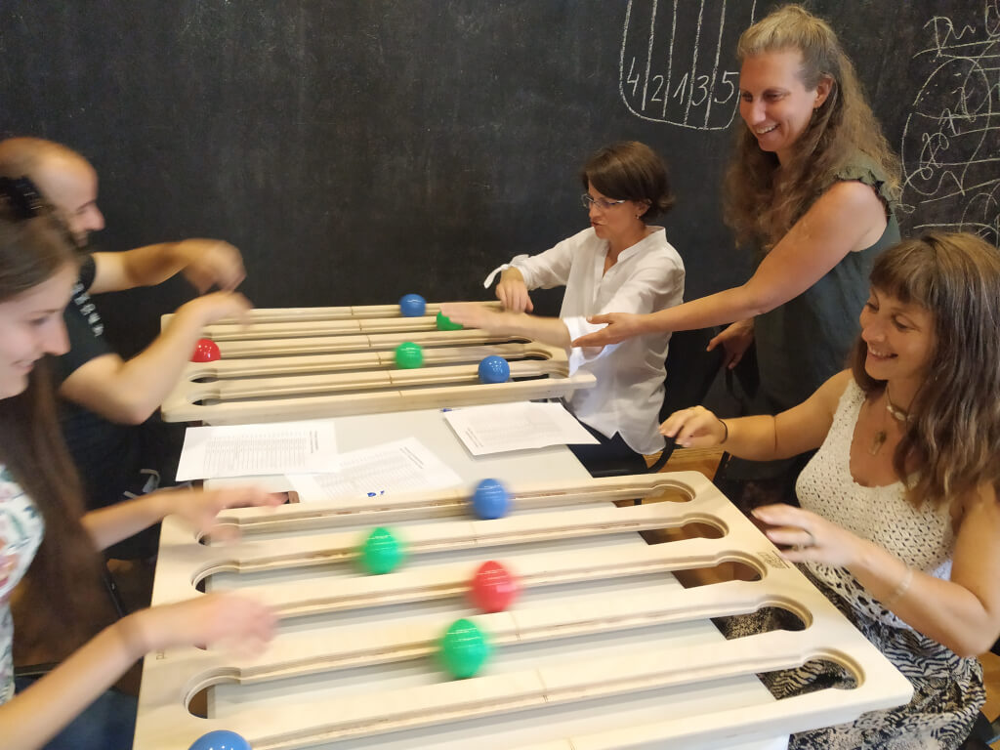
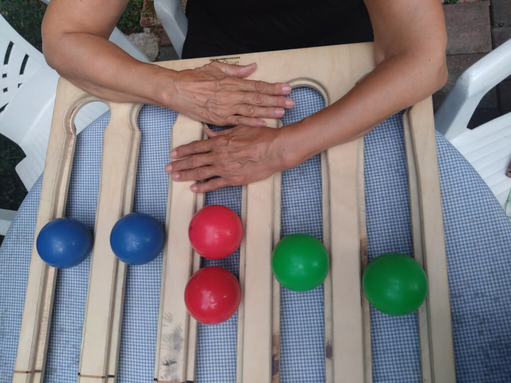
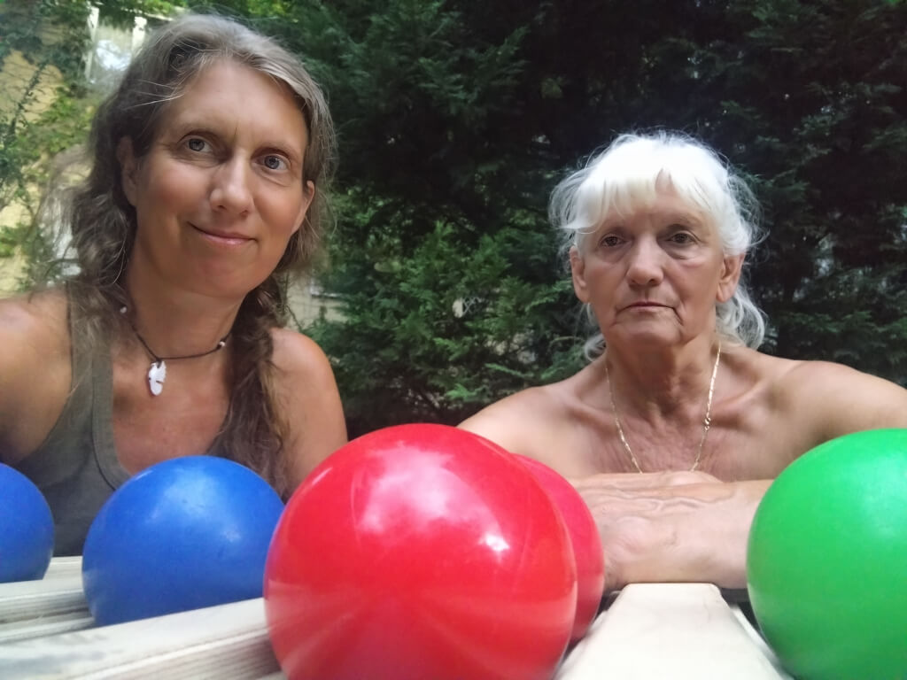

# **Supporting Wrist Fracture Rehabilitation with Functional Juggling Tools**

**Inspirál Circus Center - Budapest, Hungary**
Written by Gallyas Veronika 

## **Introduction**  
 This case study explores the use of **Functional Juggling** to support the rehabilitation process of a **70-year-old woman** recovering from a **wrist fracture**. The work was carried out over a **three-month period** in Budapest, Hungary, as a collaboration between the patient and a juggling educator trained in adaptive circus arts. The aim was to use juggling-inspired tasks to increase mobility, reduce frustration, and create enjoyable, repetitive motion-based exercises that complemented physiotherapy goals.

---

## **Background and Approach**  
 Wrist fractures, particularly of the **carpal bones**, are common in older adults due to falls. Recovery is often slow—**regaining fine motor control** can take **six months or more**. As a juggling educator with almost **30 years of experience** and formal circus training, I was intrigued by the challenge of adapting circus tools to support this kind of rehabilitation.

I began by reviewing the physiotherapist’s diagnosis and recommended exercises. My goal was to “dress” these tasks in **playful and engaging formats**—what I call “putting them in juggling clothes.” At the same time, I wanted to **introduce original movement sequences** drawn from my years of experience teaching Functional Juggling.

---

## **Methodology and Tools**  
 The work started while the client was **still wearing a cast**, using soft objects to encourage **gentle finger movements**. Later, we progressed to more complex tools and dynamic activities. I brought a **wide range of props** to each 1:1 session, selecting tools that could **stimulate wrist motion** without overloading it.

Key tools included:

* **Soft balls**: rotating two balls in the palm stimulated **finger mobility**, both during and after the cast phase.
* **Poi**: used for **multi-directional wrist movement** and micro-corrections in later stages of recovery.
* **Juggle Board**: allowed for **open-state sequences** and adaptations like **rolling with palms facing upward** to stimulate wrist rotation.
* **Floating stick**: ideal in the early phase due to limited mobility; it offered a **sense of success** and **gentle stimulation**.

All tools were left with the client between sessions to **encourage daily practice**.

---

## **Creative Strategies**  
 Inspired by **social circus methodologies**, I introduced a **mini-performance element**. Together we choreographed a piece titled **“Flea Circus”**, set to music, where two fingers portrayed elephants balancing on a ball. This playful framing **increased repetition**, sparked imagination, and made the practice more **emotionally rewarding**.

The sessions were hosted at the client’s home, though we recognized the value of the **Inspirál Circus Center’s group setting**, where community presence and varied stimuli can be highly motivating.

---

## **Key Observations**  
 Several factors contributed to the success of this process:

* The **therapeutic power of conversation**: being able to share frustrations and triumphs proved emotionally supportive.
* **Bilateral engagement**: we worked with **both hands**, even though only one was injured. This created opportunities for comparison and **cross-lateral activation**.
* **Video documentation** of sessions boosted motivation by visibly tracking progress.
* The juggling tasks helped **identify and undo compensatory movement patterns**, such as initiating wrist motions from the shoulder instead of the forearm.
* The **poi tool** initially caused frustration—its difficulty and occasional contact with the body challenged the client. We adapted by switching to a poi with **finger loops** for better control.

---

## **Challenges and Reflections**  
 One major challenge was my **limited anatomical knowledge**—while I could design effective movement sequences, I lacked a full understanding of the **complex musculoskeletal architecture** of the wrist. This at times made me feel uncertain.

For the client, the biggest challenge was **not performing the tasks well**. Yet the sense of joy and purpose she felt through **ball manipulation**—where success was tangible—offered a powerful **emotional counterbalance**.

An important element of our process was exploring the **personal significance of injury**. We discussed how the fracture might symbolically reflect **boundaries, pace, or life redirection**. This brought **meaningful depth** to our work beyond physical recovery.

---

## **Conclusion**  
 This collaboration demonstrates how **Functional Juggling** can effectively support rehabilitation in a **flexible, adaptive, and emotionally resonant** way. It’s not a substitute for clinical care, but a **vital complement**—inviting joy, story, and play into the healing process. The client now continues her progress **independently** with her own poi and soft balls, having discovered new motivation and creative tools for self-care.

