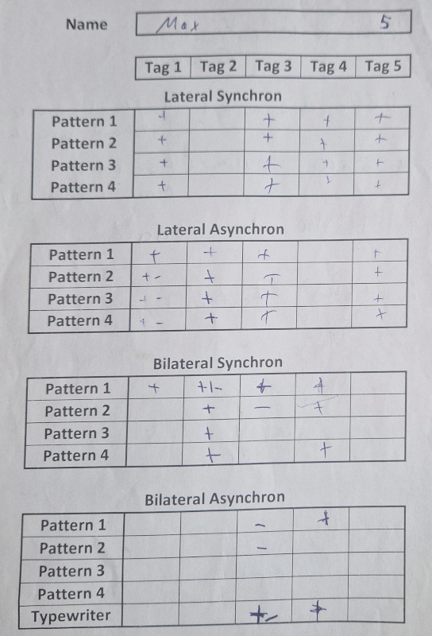
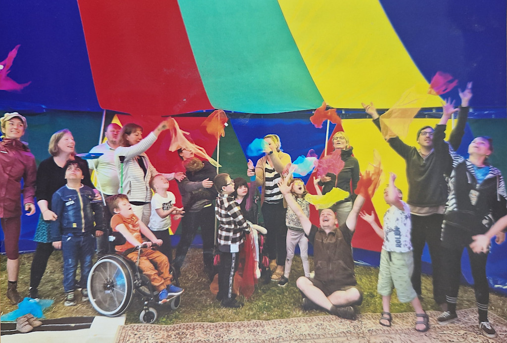

# **An Adaptive Circus Pedagogy Workshop for Children with Special Needs**

**NICA e.V. \- Halle, Germany**  
*Written by Marc Bielert*

## **Project Overview and Target Group**  
 This case study documents a five-day circus pedagogy workshop for a group of 10 children, aged 7–10 years, from a school for students with intellectual and physical disabilities, held in autumn 2024 in Halle, Germany. The participant group presented a wide spectrum of needs, from significant behavioral challenges to cerebral palsy. This diversity required a highly individualized and flexible pedagogical framework.

The project was staffed to ensure a high level of support, with three professional trainers (from our society NICA e.V.), one volunteer, and 5–6 school personnel (teachers, integration assistants), resulting in a support ratio of nearly 1:1 (roughly 1:3 in regards to our team).

## **Workshop Framework and Team Composition**  
 The workshop was conducted in a small circus tent on the school grounds, providing a dedicated and protected environment. The daily three-hour sessions were based on circus pedagogy, adapted for an inclusive setting.

The training team's qualifications included extensive professional experience in inclusive circus work (ranging from 4 to 15 years), with academic backgrounds in Educational Sciences and Social Pedagogy. A key structural element was the division of the team: **two trainers led group activities while one conducted individualized 10-minute sessions with each child daily**.

## **Project Objectives**  
 The project was designed to achieve the following objectives:

* **Needs-Oriented Experience:** Provide novel movement experiences focused on positive engagement and enjoyment, rather than performance metrics.
* **Accessibility:** Ensure all activities were accessible to every child, regardless of their specific disability.
* **Efficacy Assessment:** Evaluate the potential for observable progress within a short, intensive timeframe of individualized training in a one-on-one session.
* **Systematic Documentation:** Implement a standardized documentation process for individual sessions to track progress and ensure continuity between trainers.
* **Methodological Feasibility:** Demonstrate the viability of integrating resource-intensive, one-on-one training within a group workshop structure and within tight financial constraints.
{ align=left }

## **Methodologies and Pedagogical Adaptation**  
 The workshop utilized established inclusive methods such as **Functional Juggling, Spin Poi, and Hula Hoop Integral**, as well as ideas also present in the **IN.ZIRQUE method**. A central part of our work involved adapting activities based on participant responses.

A clear example of this process was the introduction of a **“Tic-Tac-Toe” running game**. Our initial design, which required strategic thinking and multi-step rule-following, proved to be a pedagogical misjudgment, as it was too cognitively demanding for the group. This prompted an immediate methodological shift. We **deconstructed the game into its core competencies: color recognition and spatial organization**, and introduced simpler sorting and pattern-making activities using the same or similar materials.

After building these foundational skills in a playful context, we reintroduced the original game, which the children were then able to engage with successfully. **This incident highlighted the necessity of assessing and building prerequisite skills before introducing complex tasks.**

## **Daily Schedule**  
 Each day started with a **group welcome and warm-up games** followed by concurrent **group activities** (acrobatics, balancing, etc.) and **individualized 10-minute training sessions**, as well as **shared breaks** to eat, drink and socialize. Each day ended with **cool-down and massage games**, and a **daily feedback round** to guide the next day's planning.

## **Project Outcomes**  
 **Participant Progression:** Observable progress was noted across the group. A significant outcome was observed with a **non-verbal child with cerebral palsy** who had previously shown minimal reaction to external stimuli. Through consistent, one-on-one work with a rolling ball, the child began to participate in a **reciprocal back-and-forth interaction** by the end of the week. This demonstrated the potential of targeted, patient intervention.

It is also worth noting that the progress for different children could be dependent on different trainers (some kids only opened up to female trainers, others only to male ones). This highlights that **it’s very beneficial to have a diverse group of trainers**, both in gender and other aspects.

The project was characterized by a **high degree of operational fluidity**, largely attributable to extensive **pre-project planning**, including preparatory meetings with the school to understand the specific needs and potential challenges of the participants.

{ align=left }

## **Key Learnings and Success Factors**  
 The project's effectiveness can be attributed to several factors:

* **The Value of Real-Time Adaptation:** The “Tic-Tac-Toe” example underscores that success was not contingent on a flawless initial plan, but on the team's ability to recognize a failing approach and restructure it based on direct observation of the children's needs.

* **Structured Individualization:** The systematic documentation of 10-minute individual sessions proved highly effective. It provided concrete data for progress evaluation and allowed different trainers to work with the same child without loss of continuity.

## **Conclusion**  
 The **high staff-to-participant ratio** and the **open collaboration** between our trainers and the school's staff created a **supportive and responsive environment** for all participants.

The project also illustrates the value of a **highly structured yet flexible pedagogical approach** in working with children with diverse and complex needs. The combination of **proactive planning, systematic individualization**, and the **willingness to adapt methodologies** in response to direct participant feedback were critical to the project's positive outcomes. It demonstrates that even within a short timeframe, **targeted and needs-oriented interventions** can facilitate **meaningful engagement and observable progress**.

