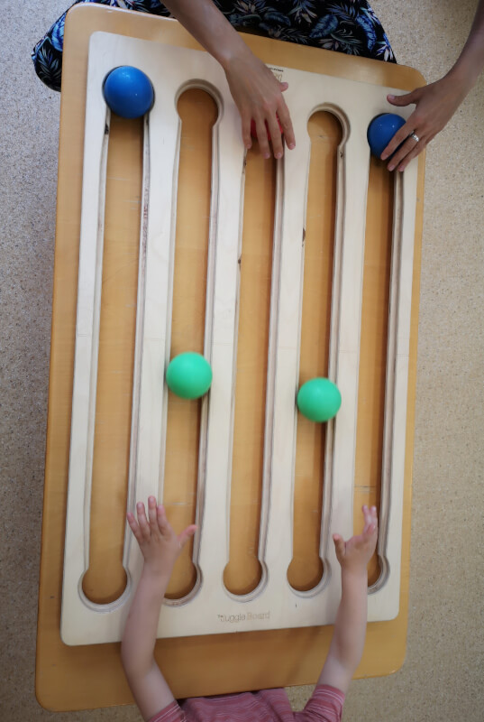

# **The Juggle Board in Kindergarten**

**Almáskert Kindergarten – District III, Budapest, Hungary**  
 *Written by Zsuzsa Székely, Somatic Education Specialist*

---

## **Introduction**

A few years ago, at **Almáskert Kindergarten** in Budapest’s 3rd district, we hosted a short workshop where special education teachers, development specialists, and interested kindergarten educators could learn the basics of **Juggle Board**. I participated in that training as a special education teacher, and those few days turned out to be energizing and deeply motivating.

Soon after, the kindergarten leadership purchased a Juggle Board for each of the institution’s three branches. This is how my journey began—working with the Juggle Board in a kindergarten that includes children with **a wide range of needs and special educational profiles**.

---

## **How It Started**

I began by integrating the Juggle Board into **individual or small-group movement development sessions**, conducted in a separate room during the morning hours. These sessions were offered to children whose personalized education plans (as prescribed by the expert committee) included movement development or therapy—sometimes as a **complementary therapeutic tool**.

---

{ align=right }
## **Early Experiences and Functional Use**

I first used the Juggle Board with **children with physical disabilities**, specifically to support **functional improvement**. For one girl, both upper limbs were affected due to central nervous system impairment, making **shoulder and hand flexion movements extremely difficult**. The Juggle Board proved to be an exciting new tool for her.

Even though the required movements demanded the same amount of **concentration and effort** as with other therapeutic tools, the fact that the balls **rolled within fixed channels** and could be initiated with **small movements** made success feel **more attainable**. This led to a stronger sense of accomplishment.

In this case, I didn’t prioritize teaching the board’s base pattern. Instead, I focused on her **individual developmental goals**, such as:

* Strengthening and stretching the hand muscles  
* Improving posture  
* Preventing compensatory movements

I often let her take the lead in the activity. I noticed that this **sense of control** made her more enthusiastic and persistent with the exercises.

---

{ align=left }
## **Adapting for Lower Limb Engagement**

In another case, I worked with a child who had significant **leg length discrepancy**. We used the Juggle Board with the **feet**. Our goal was to **activate the shorter leg**, which had limited movement due to an orthosis and was underused in daily life. After we found the right position, the child played using **only the affected leg**.

This wasn’t easy—it required intense effort and led to quick fatigue—but it was accompanied by **lots of laughter and small victories**.

---

## **Body Awareness and Integration**

We also played with the Juggle Board **using feet only** with a child who had underdeveloped **body awareness and body image**. This child barely acknowledged the existence of his legs and had difficulty moving them independently. He instinctively tried to **reintroduce his hands** during play, even though the activity focused on the legs.

Helping him develop a sense of his full body—its parts, movements, and position in space—was essential for his overall development. Behind his challenges was a rare genetic disorder that resulted in a **highly uneven cognitive profile**: excellent verbal skills but weak focus and sensory integration.

Eventually, we expanded the play to include **cognitive challenges** using hand-based table play. For example:

* Creating and remembering **color sequences**  
* Assigning animal identities to the balls, who had to “come out of their caves” when called—even if they had changed places

These activities proved effective when combined with other tools, contributing clearly to the child’s **development and maturation**.

---

## **Posture and Group Work**

We also use the Juggle Board in **group movement development classes**, particularly for **postural improvement and strengthening back muscles**. In these cases, children play lying on their stomachs.

---

{ align=left }

## **Social Integration and Observation**

Beyond motor and cognitive development, I began to notice the Juggle Board’s potential for enhancing **social interaction**. We introduced it to children who were experiencing **connection difficulties**—those who struggled with mutual attention and cooperation.

During play, I would observe:

* Whether children looked up from the board to their partner  
* Whether they requested the ball in any way  
* Whether they acknowledged the presence of the other player

For more structured cooperation, we played in **triads**, with two children on one side of the board. The game involved **simple rules** that required **collaborative problem-solving**, such as:

* One child could only roll blue balls, the other only green  
* Balls could arrive on any track  
* They had to help each other navigate space and timing without blocking one another

These dynamics were **highly informative**, both as a facilitator and as an observer.

---

## **A Case of Control and Regulation**

With one child—frequently in conflict with both peers and adults—we used the Juggle Board to observe and gently challenge **control-related behaviors**. This child had a **strong need to maintain control** over daily routines and play.

During board play, he initially attempted to take over the session subtly, then increasingly overtly—even when playing with another child under structured rules, he could take control in a matter of minutes. When playing with me, he would often withdraw quickly if the activity wasn’t fully on his terms.

This presented an opportunity: through **micro-adjustments in facilitation**, we began to build moments where he could stay in the game without compromising his sense of autonomy—creating a **balance between structure and choice**.

---

## **Ongoing Use and Professional Growth**

We now use the Juggle Board throughout the academic year to assess and strengthen:

* Motor skills  
* Cognitive processes  
* Social abilities

In every case, I have observed clear signs of growth and development in the participating children.

For me, the ongoing evolution of my Juggle Board work is supported and inspired by participation in professional workshops, where I can share experiences, learn new approaches, and renew my creative toolkit. Whenever I feel stuck or too anchored in familiar patterns, these workshops offer fresh perspectives and new energy—helping me return to the classroom refreshed and re-inspired.

