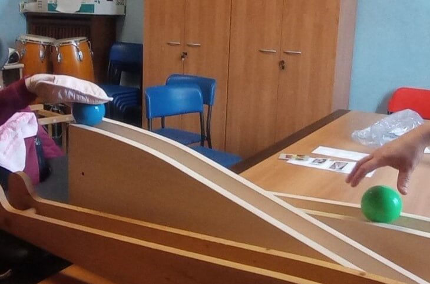
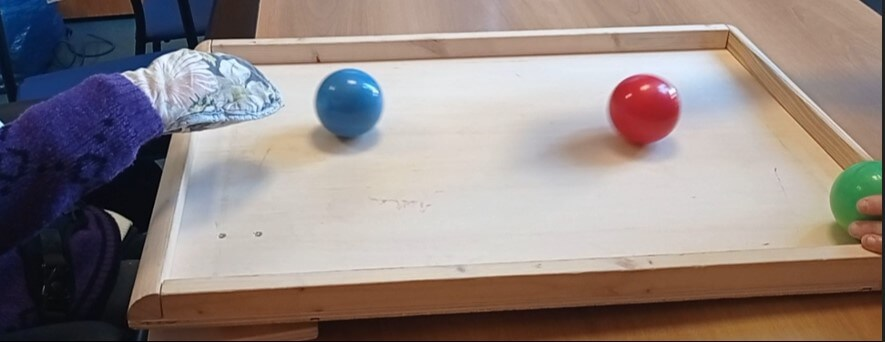
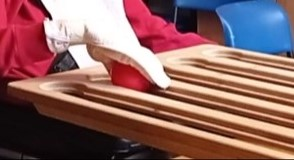

# **More Than Movement: A Long-Term Journey with Functional Juggling**

**Disabled Day Centre –  Italy**  
 *Written by Sara Papadato*

## **Target Group**

This work focuses on a person with disabilities with high support needs who attends a Disabled Day Center in the North of Italy 

She navigates her environment in a wheelchair and is accompanied by an operator. Her diagnosis often masks her warmth and potential - but beneath it all she is a woman full of energy, joy, and determination.

## **Beginning Situation**

I hold a degree in **Physical Education and Sport Sciences** and have worked in the field of disability for many years. Since 2011, I have specialized in **circus pedagogy**, and in 2018 I became a certified **Functional Juggling** facilitator through training with Craig Quat.

I first met this woman in 2016 through a **Motor Activities Training Program (MATP)**, developed in collaboration with **Special Olympics**. The activity took place at a Disabled Day Care Center managed by the **Azienda Speciale Consortile Offertasociale (Vimercate-MB)** with **Cooperativa Sociale Solaris (Triuggio- MB)** as the contracting entity 

In 2018, we transitioned from MATP to a **Functional Juggling project**, supported by a collaborative and open team of educators and therapists. When she started, her **right hand was tied to the wheelchair** due to self-injurious behavior and object-mouthing. Today, she wears a **protective glove** instead - and has gained far more **freedom** and **control**.

## **Goals**

Initially, the shared goal was simple but essential:

* **To participate in the activity without enacting dysfunctional behavior**

Over time, with input from the physiotherapist and staff, the goals evolved to include:

* **Stimulating movement in the left upper limb**  
* **Encouraging interaction with peers through juggling activities**

## **Setting and Tools**

Sessions took place in a **multi-use room**, typically used as an office, but reserved weekly for juggling. The **materials were assembled and dismantled** before and after each session, which lasted between **20 and 30 minutes**, depending on the participant’s physical condition. All work was conducted in a **one-on-one** setting.

**Props used included**:

* Juggle Board (horizontal and inclined)  
* Abacus  
* Flashcups  
* Flowersticks  
* Juggling rings

## **Process**

Since 2018, the client has participated in **weekly sessions** from October to May. Our first steps focused on building **rapport**, discovering her **interests**, and creating ways for her to engage with the activity.

In the early phase, she was always accompanied by an educator who knew her well. As our relationship grew stronger, I was eventually able to work with her **independently**.

**Each session followed a consistent structure**:

1. **Greeting and welcome** on the ground floor  
2. **Activation phase** – often with the Juggle Board  
3. **Core work** – combining color association and limb engagement using the board, abacus, and flashcups  
4. **Left upper limb activation** using horizontal movement tools  
5. **Final phase** – a game of her choice and a summary of the session

The participant was **highly engaged** with the materials and, over time, learned to better **accept and enjoy new challenges** - while still showing preferences. A key strategy was to maintain her attention on **movement-based tasks**, not on self-regulatory or avoidance behaviors, and to **frame activities as games or mini-competitions** to increase motivation.

We discovered that she was able to identify and match colors, especially when using props like the **abacus** and **Juggle Board**. These moments offered valuable opportunities to combine **cognitive stimulation** with **motor play**.

Close collaboration with the **educator team** - and ongoing support from the **physiotherapists** - proved essential in aligning our shared goals and designing effective strategies for **guided left arm activation**.

## **Outcomes**

We used **ongoing observation** as our primary method of evaluation, and the progress - although often subtle - proved to be deeply meaningful:

* In the beginning, the participant would frequently attempt to bring her right hand to her mouth as soon as it was untied. Today, this behavior appears only once or twice per session, and she is able to redirect herself back to the activity with ease.  
* Her right hand is no longer tied down and now only requires a **protective glove**.  
* She can now **intentionally reach out with her left arm** up to four consecutive times to interact with props such as the Juggle Board or Flashcups.  
* She has played with **peers, family members, and young children**, always accompanied by an educator - demonstrating increasing openness and cooperation.

Perhaps most remarkably, she has become the **“expert”** of the Functional Juggling activity within the center, frequently demonstrating what she has learned to others - with evident pride.

There is still **room for growth** - particularly in implementing more measurable tracking systems. Ideally, future sessions would integrate **video documentation** or **sensor-based tools** to enable deeper layers of reflection and **data-informed analysis**. These additions could support both real-time facilitation and post-session review, enhancing the clarity and continuity of long-term progress monitoring.

---

## **Conclusions and Reflections**

Working long-term with a person with complex disabilities requires **patience, consistency**, and deep **commitment**. At first, I felt uncertain - wondering if any real change was taking place. But slowly, with the attentive eyes of her educator team, I began to see the truth: the **tiny shifts** were in fact **huge steps**.

What we do with Functional Juggling is not just about movement - it’s about **trust**, **attention**, **presence**, and creating the conditions for each person to **show us who they are and what they’re capable of**.

It may not always *look* like progress - but when we learn to look differently, we begin to see just how far someone has come.

