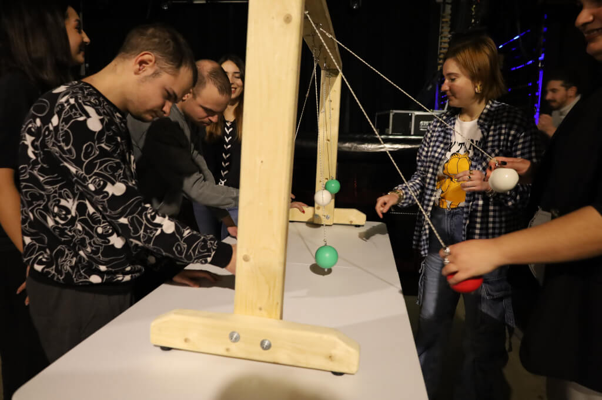
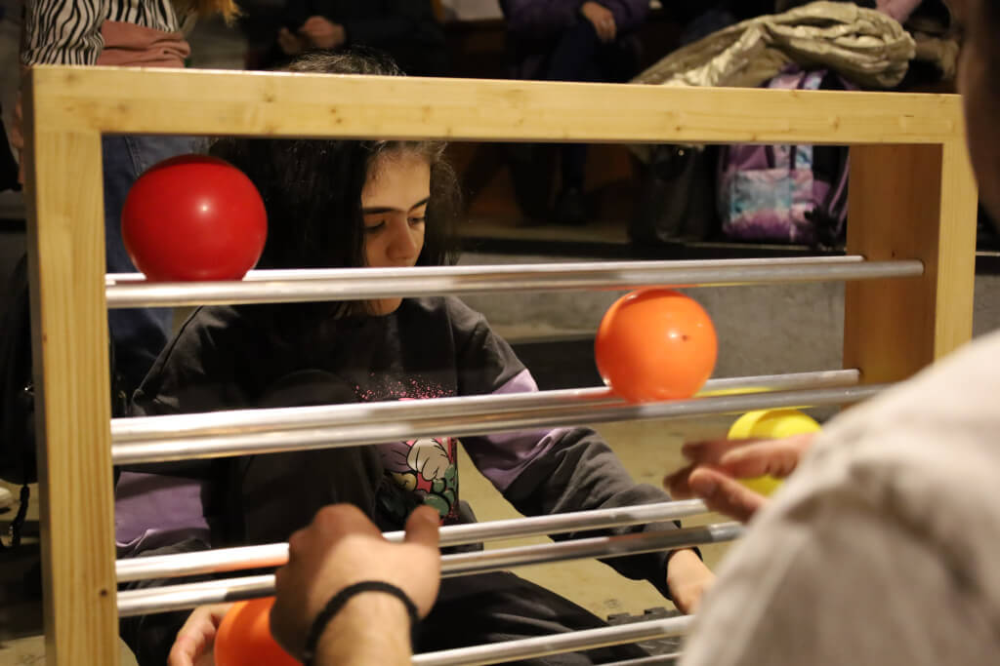
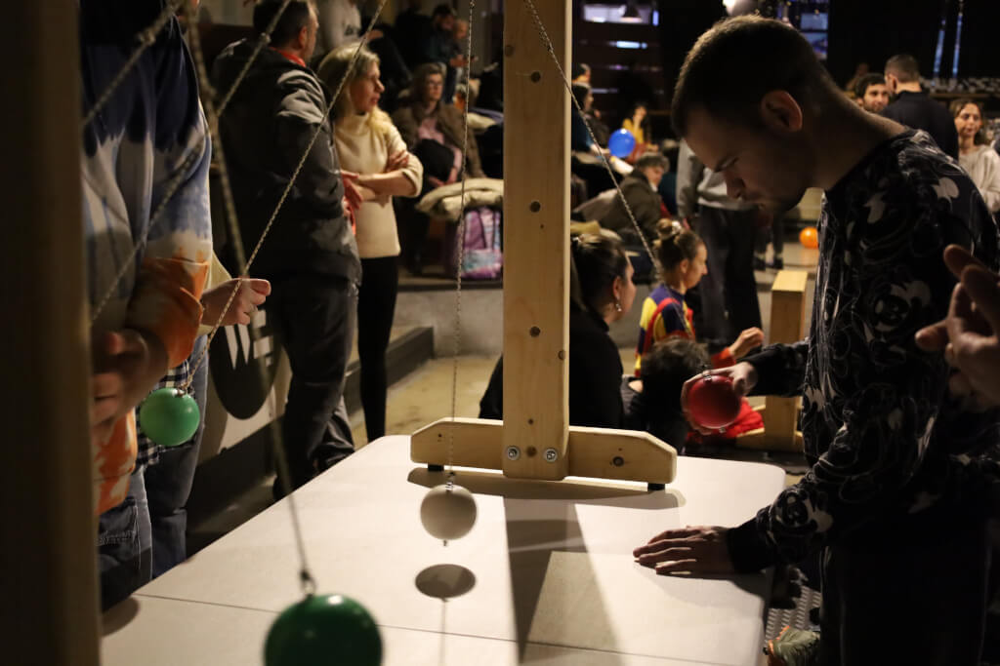

# **Colours and Patterns to Unlock Friendly Interactions**

[[Monokyklo]] -  Thessaloniki, Greece
**Written by** the Monokyklo team

---

## **Structure and Setting**  
 
Each session began with a **brief introduction of the games** to both trainers and participants, followed by **free exploration**. Participants were encouraged to **take initiative**, allowing us to observe which **patterns, colours, or movements naturally attracted their interest**. Facilitators provided **gentle, non-intrusive support**, focusing on encouragement and autonomy.

Sessions took place indoors in **designated recreational areas** of each DDC. Materials were displayed on tables and included:

* The **Juggle Board**
* **Hula hoops**, **spinning plates**, **scarves**, and **juggling balls**

The program ran for several months, with **near-daily visits to five different centers**, creating an opportunity for **longitudinal observation and diverse participant engagement**.

---

## **Session Flow and Game Design**  

Each 90-minute session followed a consistent structure:

* Opening **circle game** where everyone shared names and personal updates
* A **main session** with rotating activity stations or small-group games
* A **10–20 minute break** depending on group energy
* Closing **group reflection**, sharing highlights and feedback

The activities rotated through **Functional Juggling games** and other circus-based experiences. Some sessions used a **clock-style layout**, allowing participants to move independently between activities. The structured yet playful design allowed for **adaptation to individual interests and needs**.

---

## **Observations and Outcomes**  

The central focus—**facilitating social openness and peer interaction**—was clearly met. We observed:

* **Stronger interpersonal connections**, especially among previously withdrawn individuals
* A noticeable difference in **game preferences** based on age and type of disability
* Two participants with hyperactivity displayed **impulsivity**, though it remained **non-disruptive**
* Participants were **drawn to bright colours and structured patterns**, and although creating new sequences was challenging, most persisted and **succeeded with guidance**

**Familiar educators played a crucial role**. When participants were supported by someone they trusted, **focus, engagement, and joy all increased**. Tools that incorporated **colour and number coding** proved especially effective. Across all five DDCs, participants showed:

* **Greater behavioral regulation**
* **More consistent participation**
* **Increased openness to trying new things**
* **Heightened social engagement** with both peers and trainers

---

## **Conclusion**  

This initiative demonstrated how Functional Juggling can be a **powerful tool for inclusion and connection**. With **more frequent and structured sessions**, we believe it would be possible to achieve even **greater progress in motor skills, cognitive engagement, and social behavior**.

The consistent involvement of **DDC staff was a key success factor**. Their presence helped build a **secure and familiar atmosphere** in which participants felt safe to explore, take risks, and form new relationships. The program not only enriched the daily experience of the participants but also **empowered caregivers and educators** to engage with inclusive pedagogy in a practical, joyful way.

