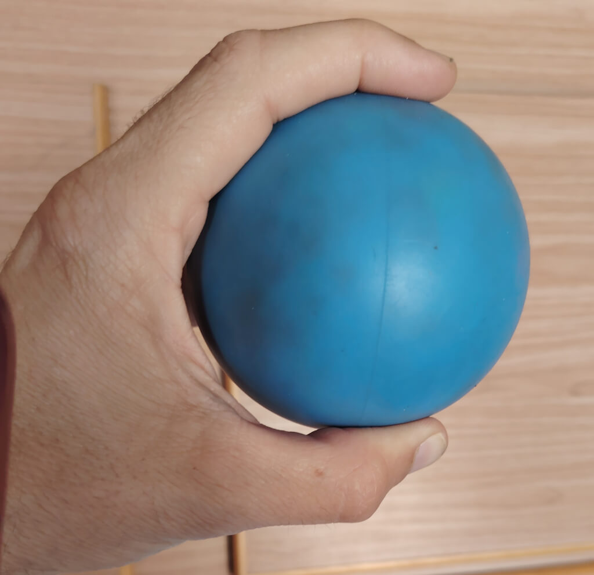
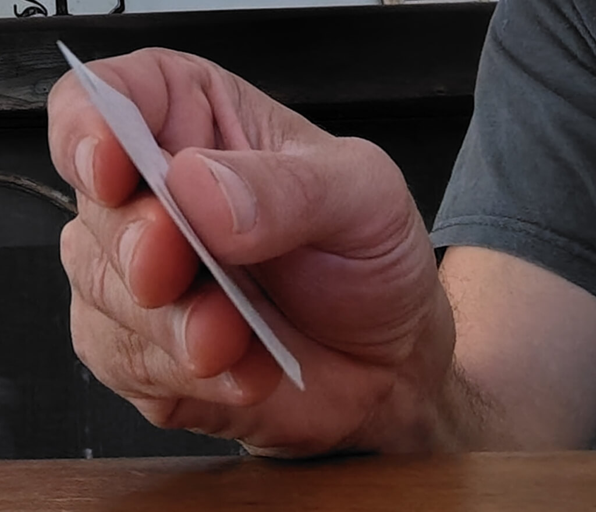
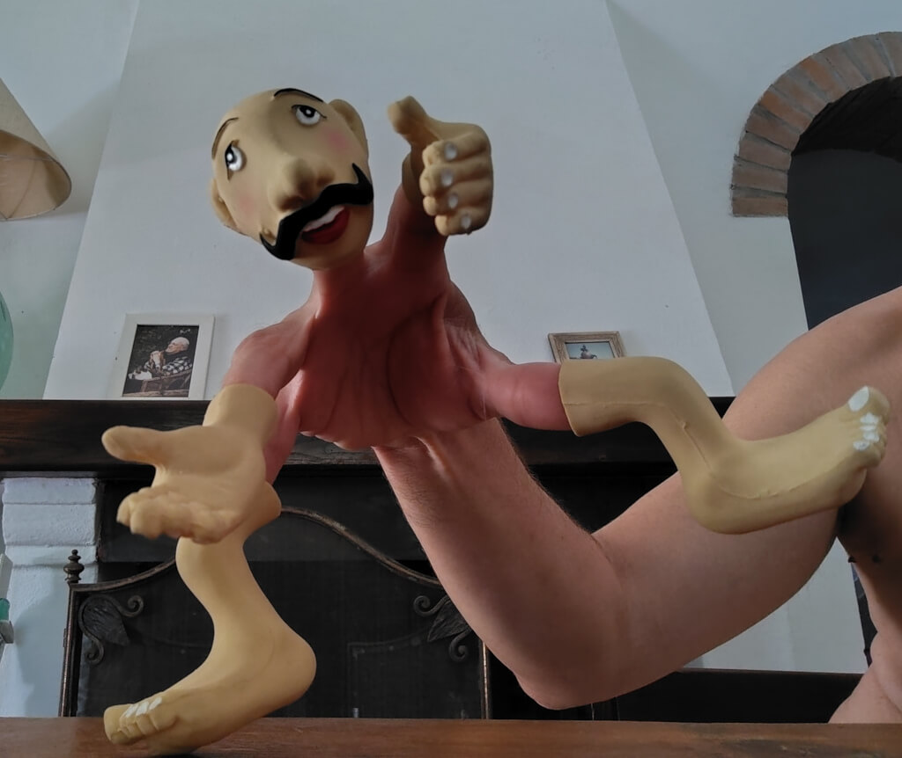

# **Rebuilding Grasp — Functional Juggling and Hand Rehabilitation in Florence, Italy**

**Disabled Day Centre – Trezzo sull'Adda, Italy**  
 **Written by** Lapo Botteri  
 **Delivered by** Circo Tascabile at the C.T.E. center in Cinque Vie, Florence

---

## **Target**  
 This project focused on **adults with severe motor disabilities**, particularly individuals with **impaired hand gripping ability**. The participants—six residents of the C.T.E. center in Cinque Vie, Florence—were all **wheelchair users**, each presenting **complex physical challenges** but maintaining **medium-to-high cognitive functioning**. The initiative was developed in close collaboration with the facility’s physiotherapists, with the goal of **supporting rehabilitation efforts through playful, curiosity-driven activities** that promote **neuro-motor adaptation**.

---

## **Beginning Situation**  
 My name is **Lapo Botteri**, and I hold a degree in Physical Education with additional certification as a sports teacher. I first encountered **Functional Juggling** in 2016 through a workshop with **Craig Quat**. The experience **shifted my professional trajectory**. Within weeks, I approached a local therapy center and began integrating the methodology into my practice. I’ve remained with the same organization ever since, now working **13 hours per week** and developing **long-term, individualized programs**.

The C.T.E. center serves individuals with **complex mobility limitations**, many of whom face additional challenges such as **spasticity**, **limited range of motion**, or **coordination impairments**. While physiotherapists focus on biomechanical rehabilitation, my role—through Functional Juggling—has been to engage **neuromotor programming** at the intersection of **play, precision, and movement intelligence**.

---

## **Goals**  
 Each participant had a **personalized set of goals**, defined in collaboration with the center’s staff. The primary objective was to **support upper limb rehabilitation** through **sensory-motor exploration**. Secondary aims included:

* **Enhancing grip strength and manual dexterity**
* **Encouraging ambidextrous coordination**
* **Improving attention span and cognitive-emotional engagement**

---

## **Setting and Tools**  
 **Working Space**  
 Sessions were held in the center’s **small gym**, a quiet, adaptable space well suited for **sensory-focused activities**. Each participant engaged in a **15-minute one-on-one session**, once per week, from October to May.

**Working Tools**  
 Materials were selected according to each participant’s abilities and goals. These included:

* **Juggle Board**
* **Juggling rings**
* **Stress balls**
* **Finger puppets**
* **Rain sticks**
* **Animal squeakers**
* **Flashcups**
* **Household objects** (cutlery, brushes, bottles)
* **Sensory props** tailored to specific grip types

---

## **Process**  
 The program unfolded weekly across **eight months**. Each session followed a structured flow, with content **adapted to each individual’s physical and emotional needs**.

**Preparatory Phase**  
 We began with **verbal check-ins and tactile activation**. Questions like “How are you today?” were paired with **gentle hand and arm massages** to increase **body awareness** and reduce tension.

**Analytical Phase**  
 We explored **fine motor skills** and **targeted movement patterns** such as finger isolation, wrist rotation, and bilateral integration. The goal was to **refine precision and self-awareness** in movement.

**Global Phase**  
 Refined elements were combined into **integrated tasks**, such as **controlling ball movement on the Juggle Board** or **exchanging juggling rings rhythmically**. These tasks emphasized **functional flow, coordination**, and **movement confidence**.

---

## **Organization Process**  
 Two interdisciplinary teams provided essential input throughout the program:

**Educators**  
 They offered background on each user’s **daily behavior, emotional profile**, and **learning preferences**, helping to **adjust session pacing and tone**.

**Physiotherapists**  
 They ensured **technical safety**, advising on posture, muscular limitations, and safe movement ranges. Their guidance allowed for **creative exploration within a safe biomechanical frame**.

While we encountered no major obstacles, we did observe **unexpectedly high levels of engagement and improvement**, surpassing initial expectations.

---

## **Output**  
Though **no formal metrics** were used, feedback was collected from across the team:

**Physiotherapists**  
 Reported **no measurable biomechanical changes**, but recognized that the work **complemented their sessions meaningfully**.

**Educators**  
 Observed **notable improvements in attention, behavioral regulation**, and **hand coordination**. Participants began **using both hands more naturally** and showed progress in handling tools like **pens, cups, and utensils**.

**Music Therapist**  
 Saw **enhanced control and intention** while participants used musical instruments, particularly when **striking mallets on xylophones**.

**Speech Therapist**  
 Noted **improved focus** and greater ease in operating **manual communication devices**.

---

## **Conclusions and Reflections**  
 Two central questions emerged:

**First**: Why did the **physiotherapists observe less change** than other team members? Their clinical lens is crucial, yet it may **overlook the subtle functional gains** made through embodied play.

**Second**: How can we better document this type of change? In future projects, we hope to implement **baseline assessments and post-session comparisons**, using tools like **video analysis or motion sensors**, to more clearly track outcomes.

**Functional Juggling may not yield instant results.** But it **creates space for small miracles**—like holding a spoon, gripping a pencil, or striking a mallet with **renewed purpose and joy**.

