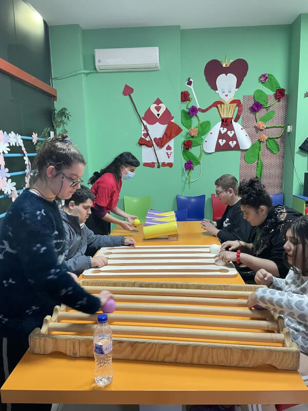
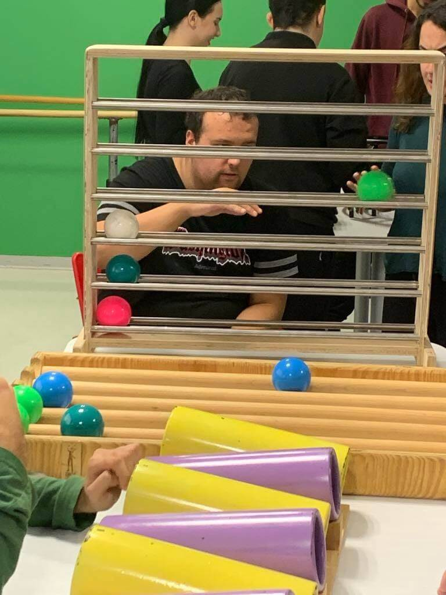

# **Feeling Safe: A Key for Autism**

[[Monokyklo]] - Thessaloniki, Greece
*Written by Eva Parlani*

## **The Beginning**  

The **Monokyklo team** introduced methods of *Functional Juggling* in Thessaloniki, with the primary goal of making **circus arts accessible to people with disabilities**. The team was composed of trainers with backgrounds in circus arts and specific training in Functional Juggling, gained through participation in international seminars and facilitator courses.

The project, titled **“A Rolling Ball”**, was designed as an **integrated intervention** at various **Disability Daycare Centers (DDCs)** in Thessaloniki. It aimed to offer a **creative, inclusive space for expression** through the language of juggling and movement.

As a facilitator with experience in circus workshops and having attended trainings in **Thessaloniki, Budapest, and Milan**, I entered the project with a **deep desire to make circus arts accessible to all**—free of exclusion or discrimination. My focus as team leader was on **strengthening group dynamics** and creating a **safe, supportive environment** in which participants could explore an unfamiliar activity with **confidence and comfort**.

A key component of the project was that we **visited participants in their own environments**, bringing all necessary materials with us. This approach, which allowed individuals to remain in **familiar and protected spaces**, proved essential in facilitating their **early engagement and comfort** with the activities. It became clear that **respect for each participant’s rhythm and individuality**, along with **active collaboration with on-site educators**, contributed significantly to the project’s success.

---
## **The Case of Nikolas**  

Among the many stories that emerged, **Nikolas** stood out.  Nikolas, around ten years old, is **on the autism spectrum**. He experiences **limited speech and expressive abilities** and typically **moves through space only with the support** of a special education teacher. He was particularly sensitive to **loud sounds** and **sudden movements**, which made him cautious and hesitant during our initial sessions.

During our **first two visits**, Nikolas remained at a distance. He **did not approach the props**, and although we addressed him with openness and care, he **did not respond to verbal interaction**. His **physical and emotional distance** remained steady.

But something shifted during the **third session**. For the first time, **Nikolas picked up the juggling balls**, made **eye contact**, and **accepted our presence**. From that moment forward, a connection began to form. He started **welcoming us with trust**, helping to set up the space, **trying new combinations**, and **returning to the props independently**.

I believe we were able to offer Nikolas a **non-threatening environment**—a space where he could **experiment, create, try, and even fail** without fear of judgment. It was a **safe space for self-expression** and discovery, where his process could unfold at **his own pace**.

From that point on, Nikolas **never missed a session**. He **remembered the combinations** we practiced, **tried new ones with enthusiasm**, and increasingly showed **independence** in his exploration. Over time, he **reduced reliance on his support teacher**, and in a powerful moment of connection, began to **share personal information** with us—an act that signified deep trust.

Through this process, we witnessed a clear **increase in Nikolas’s self-confidence**, **communication skills**, and **social openness**. His journey is just one example of the **transformative power of Functional Juggling**, both for **psycho-emotional growth** and **physical activation**.

{ align=left }

---

## **Personal Reflection**  
This experience has been **deeply transformative** for me—not just professionally, but personally. I was able to **apply a method I believe in**, and at the same time, witness how **circus can serve as a tool for inclusion, empowerment, and communication**.

Being in daily contact with participants—their **unique responses**, their **small or big victories**—reminded me of the **power in simplicity**: the simplicity of **movement**, of **play**, of **being present**.

This process **strengthened me as a trainer**, as a facilitator, and as a human being. It reaffirmed my belief that **art can be a bridge**—a tool for **access**, for **connection**, and for **solidarity**.