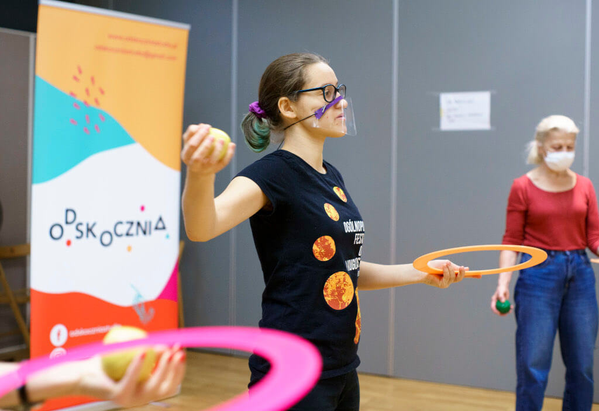
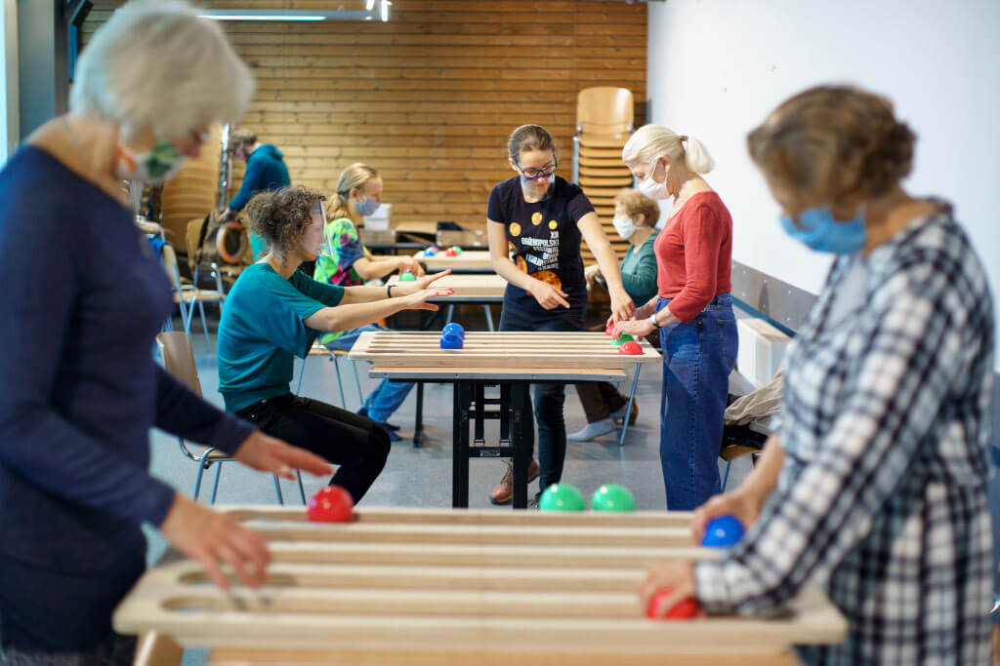
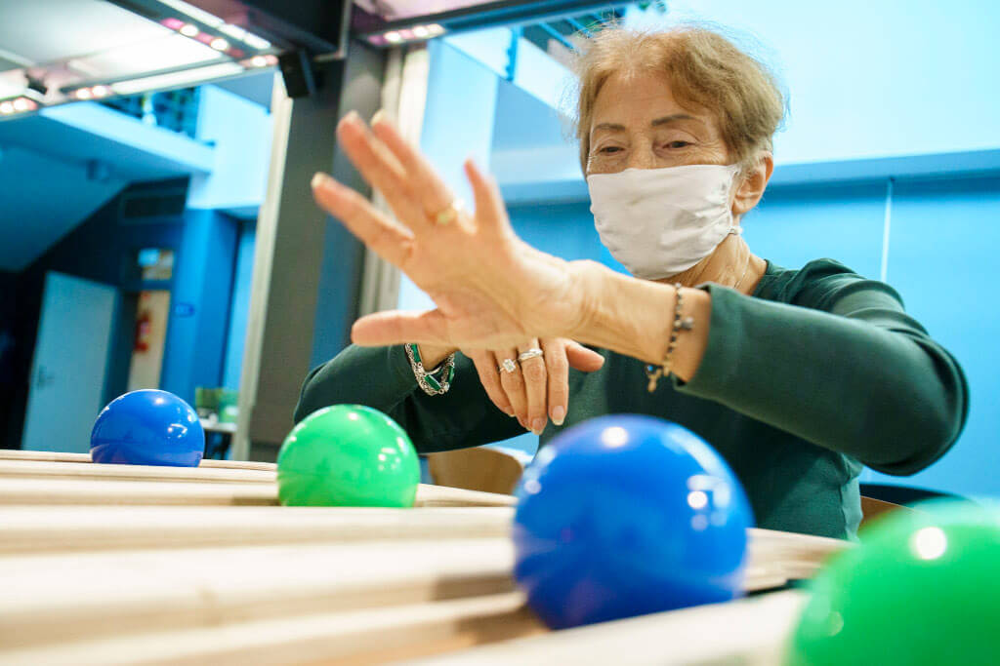

# **No Age Limit — Functional Juggling with Seniors During Lockdown**

**Odskocznia Studio, Warsaw, Poland**  
 *Written by Wiktoria Witenberg*

## **Target Group**  
 This project, led by **Odskocznia Studio**, was designed for **adults aged 65 and older**. Through an **open call**, we invited seniors to join **Functional Juggling (FJ)** classes hosted at the **Centrum Kultury Praga-Południe** in Warsaw. Participants were **independent, active older adults**—capable of registering and attending on their own—whom I would describe as functioning at an **average to high level for their age**.

---

## **Origins and Context**  
 The idea emerged in **March 2020**, during the first **COVID-19 lockdown**. Paulina, founder of Odskocznia Studio, expressed interest in developing a **circus-based program for seniors**. A few months later, as restrictions temporarily lifted, we began planning. Despite rising case numbers and the threat of a second lockdown, we made the collective decision to proceed—with caution.

Our **team of four trainers** included:
* Two main trainers (with some experience teaching juggle boards)
* Two support trainers (new to Functional Juggling)

Each **group of up to 12 participants** was led by one main trainer and one assistant.

My own background included:
* A **three-day workshop** with Craig Quat in 2017 (before “The Seminar” was formalized)
* A **pilot project** with seniors in Warsaw (6 sessions / 9 hours)
* Several **one-on-one FJ sessions**

Kamil, one of the main trainers, had co-led the pilot. Paulina and Julia were new to the methodology. Before launching **No Age Limit**, I conducted a **two-hour training** on basic FJ principles and **Juggle Board patterns** for the support trainers.

---

## **Goals**

**Trainer Development**  
 To give new trainers **hands-on experience** facilitating Functional Juggling, helping expand a local base of **confident and independent facilitators**.

**Participant Wellbeing**  
 To provide seniors with **joyful, embodied experiences** that supported **social connection and physical activity**, especially during a time of **heightened isolation**. Sessions were designed with a focus on **emotional safety, sensory play**, and **flow-state movement**, while respecting **strict health protocols** (distancing, masks, no physical contact).

---

## **Setting and Tools**  
 Classes took place in a **spacious basement** of the cultural center. Initially, we imagined a cozy yoga studio, but the open space proved ideal for **safe distancing**. We divided the room into two zones:

* A **seated circle** for group reflection
* A **Juggle Board area**, where each pair had a **dedicated table spaced two meters apart**

During the **first session**, all participants chose to remain seated. But over time, **more began standing**—a sign of **growing confidence** and **physical comfort**. We always ensured that **chairs were available**, allowing participants to begin where they felt safe.

Props included:
* **Juggle Boards**
* **Scarves, balls, rings, clubs, poi**
* **Peacock feathers**
* **Hula hoops** (introduced in the final session)

For two sessions, we moved into a **smaller enclosed gym** to explore feathers and hoops. The intimate setting allowed for **creative chaos** while maintaining **group cohesion**—something more difficult in the larger space.

---

## **Session Design and Flow**  
 The program ran for **five weeks**, with **one 90-minute session per week**, always scheduled in the mornings (which, as we later learned, was **not the preferred time** for many participants).

**Session Structure**:
* **Welcome Circle**
* **Brain Warm-Ups** (e.g., bilateral coordination, “pianist” finger exercises)
* **First Prop-Based Activity** (always the Juggle Board)
* **Short Break**
* **Second Prop-Based Activity** (rotating: poi, scarves, balls, feathers, hula hoop)
* **Reflection and Goodbye Circle**

With this elder group, the **opening and closing circles naturally extended** longer than in other contexts. Many participants expressed a strong need to **share, reflect, and connect**—a meaningful response to months of isolation.

Each session was guided by **one trainer and one assistant**, ensuring **individualized attention** and supportive pacing.

---

## **Outcomes and Reflections**

**Trainer Development**  
 Due to the **second lockdown**, our capacity to **mentor new trainers** was limited. As the lead facilitator, much of my energy remained focused on managing the group’s **emotional wellbeing**. Still, the support trainers gained valuable **hands-on experience** and a clearer understanding of **foundational FJ patterns**.

**Participant Wellbeing**  
 This goal was **fully achieved**. The group remained engaged and joyful throughout, and we concluded the program with a room full of **satisfied, connected participants**.

One key insight involved **scheduling**. We had assumed that seniors would prefer morning sessions. However, feedback revealed a **preference for later times**, reminding us to **challenge assumptions**—even those based in logic or past experience.

To assess outcomes, we used both **verbal feedback** and a **creative tool**: the **Blob Tree**. Participants selected and colored the character that best reflected how they felt. Most chose the figure **center stage in the spotlight**. Their comments spoke of feeling **seen, appreciated, and connected**—after just five sessions.

---

## **Closing Thoughts**  
 In a time of fear and uncertainty, this project created a **small but powerful space** for **community, joy, and presence**. Even with **masks and distance**, even during lockdown, it was possible to **cultivate connection**.

**Functional Juggling** and **social circus practices** provided more than physical activity—they offered a **path to resilience, expression, and belonging**. The experience reminded us that **age is not a limit, but a beginning**.

