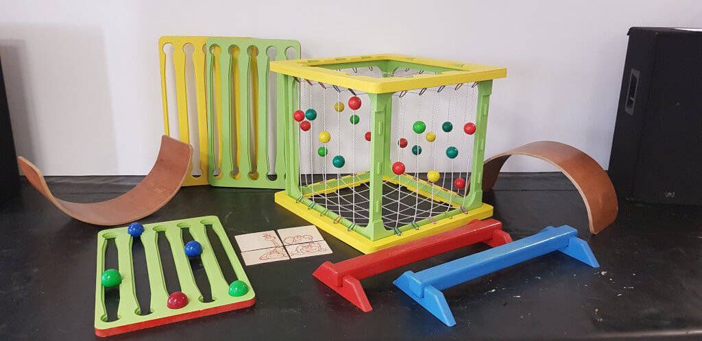
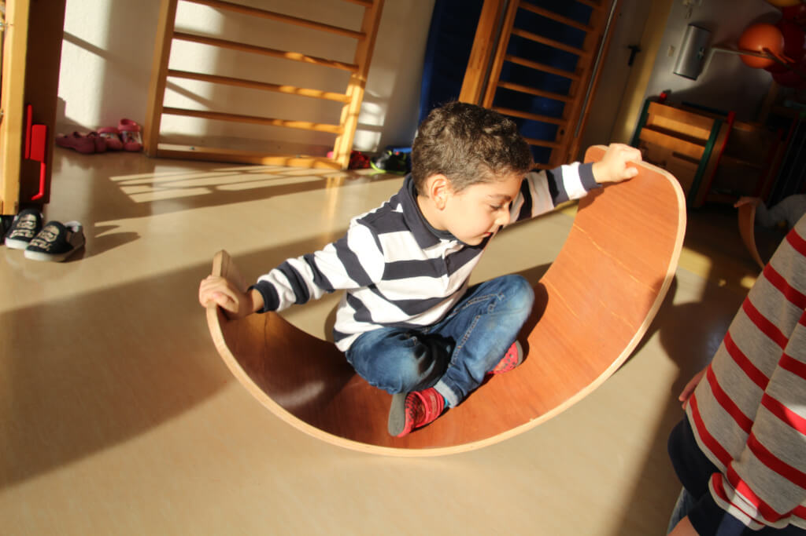
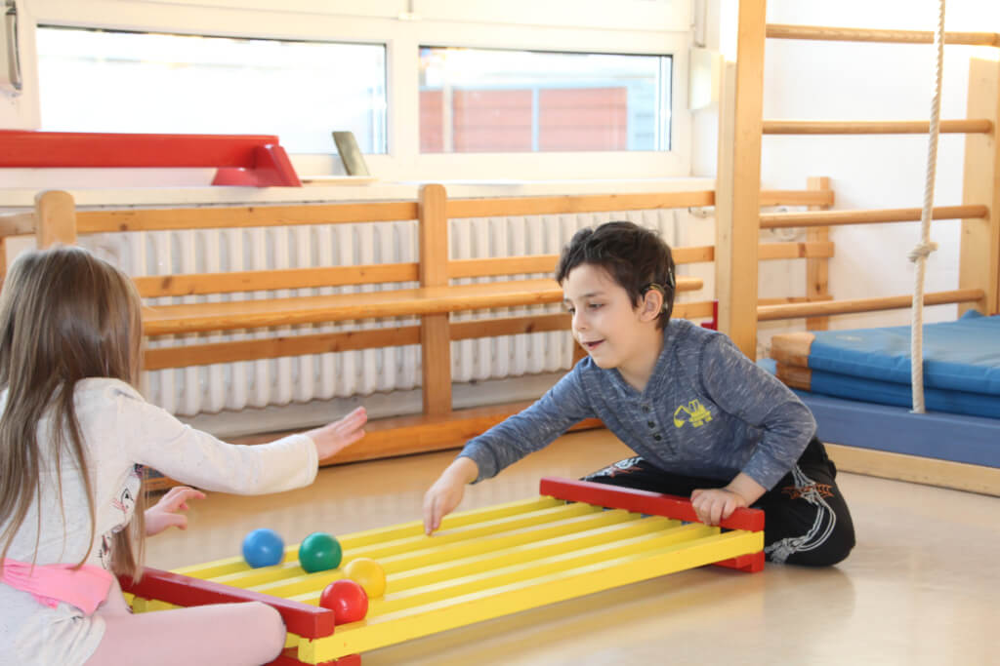

# **Movement and Play in Early Childhood Education**

**NICA e.V., Halle, Germany**  
*Written by Marc Bielert*

## **Project Overview and Context**  
 This case study explores a long-term circus workshop delivered in a **kindergarten located in a socially disadvantaged area of Eastern Germany**. The project became a valued and consistent part of the weekly routine, engaging a **highly diverse group of children aged 1.5 to 6 years**. According to the kindergarten director, approximately **90% of the children spoke German as a second or even third language**. This linguistic landscape created a persistent communication challenge: some children had learned to signal understanding to please adults, even when confused.

This required facilitators to develop **strong sensitivity to both verbal and non-verbal cues**. The team, composed of **two facilitators with 4 to 15 years of experience** in inclusive circus work and academic backgrounds in **Educational Sciences and Social Pedagogy**, encountered a familiar reality in under-resourced communities: a **dedicated but understaffed educational team**. This limited the kindergarten’s ability to offer individualized support, making the external workshop a **welcomed addition** to the children’s lives.

---

## **Philosophy and Pedagogical Approach**  
 The project was guided by a **simple yet powerful principle**: children are exposed to a **wide variety of movement experiences in a playful setting**. The pedagogical approach emphasized **equality**, **eye-level interaction**, and the creation of a **low-pressure, exploratory atmosphere**. Success was defined not by performance, but by **engagement, curiosity**, and the **freedom to try, fail, and try again**.

This gentle environment coexisted with **clear structure and boundaries**. Facilitators maintained **rules and adult authority when needed**, ensuring safety and group cohesion. At the same time, children were encouraged to **navigate minor social conflicts independently**, fostering **negotiation and self-regulation skills**.

---

## **Materials and Environment**  
 Workshops were held in a **small sports room** transformed using both **specialized and traditional circus equipment**, including:

* **Juggle Boards**, enabling structured pattern exploration without scattered balls

* **Newton Devices**, for controlled tossing and coordination

* **Curved Wobble Boards**, for balance, crawling, and rolling

* **Parkour elements**, such as beams and mats for gross motor development

* Later additions: **poi, hula hoops, scarves**, and **spinning plates** to enrich sensory and movement variety

This environment was designed to be both **inviting and developmentally supportive**, allowing children to explore movement freely while fostering key motor skills.

{ align=left }

---

## **Workshop Design for Toddlers (Ages 1.5–3)**  
 Participation was always voluntary. To ensure fairness, **children were selected through a mix of random choice and educator recommendation**. The team aimed for a **low trainer-to-child ratio (ideally 1:4)** to provide the individual attention otherwise unavailable.

Each **60-minute session followed a ritualized structure**:

* A **welcome song with movement** created rhythm and psychological safety

* Immediate engagement with **physical play**, including parkour and Juggle Board games

* **Finger-plays and familiar songs** provided structure and focus

* To prevent overstimulation, **no recorded music** was used—only **live group singing**

* A **farewell song** and a **coloring picture** as a participation token closed the session

This predictable sequence offered **comfort and rhythm** to a group too young for complex narrative structures.

{ align=left }

---

## **Workshop Design for Pre-Schoolers (Ages 4–6)**  
 The 90-minute sessions for older children built upon the same foundations but were **enriched with a narrative arc**. Each session was tied to **one of five stories**, each linked to a **puzzle piece** that served as a **motivational and symbolic anchor**.

The activities followed a **dynamic flow**:

* **High-energy parkour**

* **Focused coordination** with the Newton Device

* **Cooperative, calming play** on the Juggle Boards

As children completed each phase, they **earned a new puzzle piece**, creating a sense of **progression and excitement**. **Recorded music and movement games** like freeze dance were incorporated to sustain energy and enjoyment.

{ align=left }

---

## **Outcomes and Observations**  
 Short-term outcomes were **consistently positive**. Children were **joyful and deeply engaged**. Facilitators observed improvements in **physical abilities** (balance, coordination), **cognitive development** (concentration, focus), and **social confidence**.

A striking observation was the **sustained attention of toddlers**. Children as young as 1.5 years remained focused for the **entire session**—a fact noted with **astonishment by the regular educators**.

The project’s strengths—**eye-level interaction, low-pressure play, and empowerment in conflict resolution**—created a deeply **nurturing environment**. However, the very success of the program posed a challenge: **demand consistently exceeded capacity**. The children's enthusiasm made it emotionally difficult to limit group size, and the **ideal trainer ratio was occasionally stretched**.

---

## **Evolving Practice and Future Directions**  
 Over its **seven-year evolution**, the project methodology has continued to adapt. For the older group, facilitators are now **shifting away from rigid narratives** toward **more open-ended, child-led activities**. Traditional circus skills like **poi and plate spinning** are becoming more central.

Additionally, facilitators are **incorporating children’s favorite songs** into free-play segments, enhancing **personal relevance and emotional connection**. The project continues to explore how to maintain its **core values of inclusivity and engagement**, while responding flexibly to changing needs and interests.

