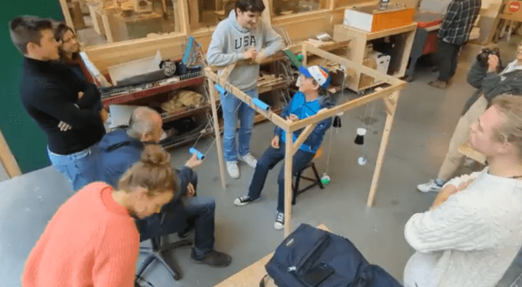
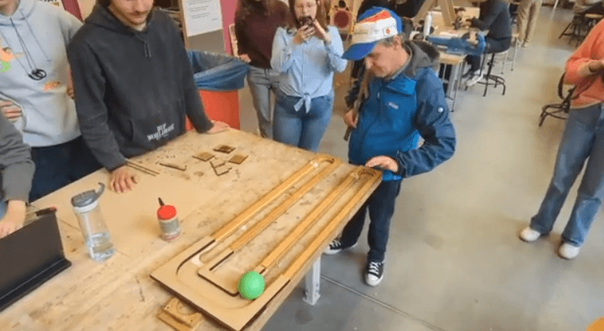
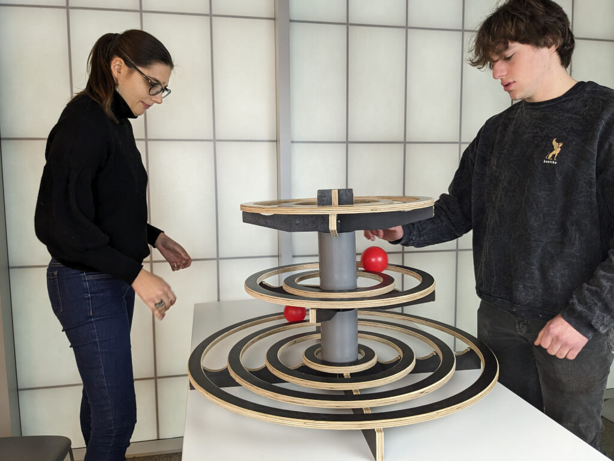

# **Case Study: Designing Together – Inclusive Circus Props Through Cross-Sector Collaboration (Belgium)**

*Written by Elga Pollet, Director of Circusatelier Woesh*

---

## **Overview**

This case study explores a multi-year, cross-sector collaboration between **inclusive circus educators**, **university students**, and **community organizations** in Belgium. The initiative was spearheaded by me, **Elga Pollet**, together with the dedicated team at **Circusatelier Woesh**, based in the West Flanders region.

With activities spanning **Bruges, Oostende, Roeselare**, and **Kortrijk**, Woesh has long been committed to blending **artistic circus practices** with a deep **social mission**. The project described here was developed as part of a larger initiative called **Bushcraft**, a long-term program dedicated to sustainable and inclusive circus development in Flanders and beyond.

In 2019, our team asked a central question: **How can we transform short-term interventions into long-lasting, self-sustaining inclusive programs?**

The result was a dual-track approach combining:

1. The creation of **Customized Circus Assistant roles** for people with disabilities  
2. The **collaborative design of inclusive circus props** through academic partnerships

International collaborators such as **Craig Quat**, founder of **Quat Props**, joined us during this process—offering insight, mentorship, and validation that helped shape our work.

## **Track 1: Customized Circus Assistant Roles**

In our workshops and outreach programs, we consistently include participants with **physical and intellectual disabilities**. While we saw meaningful moments arise from these encounters, we realized that **short-term inclusion wasn’t enough**. 

We wanted to go further. So, we asked ourselves: **Could people with disabilities also become facilitators and leaders within our programs?**

To test this, we partnered with local networks such as **VZW De Viersprong** to create long-term **assistant positions** within our team. These assistants—adults with disabilities, elderly participants, and youth from vulnerable backgrounds—received ongoing training in:

* **Basic circus pedagogy**  
* **Facilitation strategies**  
* **Physical expression and sensory engagement**

One of the most effective tools we used was the **Juggle Board** system. Its **non-verbal interaction**, **rhythmic structure**, and **accessible entry point** allowed assistants to co-lead from the very beginning.

With time, our assistants took on increasingly meaningful responsibilities:

* Leading sessions in **schools**, **care homes**, and **public spaces**  
* Collaborating directly with **lead facilitators** and being supported by dedicated coaches  
* Learning **symbolic communication systems** or **sign language** to enhance accessibility

One of our assistant groups has now been active for **more than five years**, demonstrating the sustainability and depth of this model. Their presence has enriched our classes and brought new levels of **empathy, diversity, and shared ownership** into our pedagogy.

## **Track 2: Inclusive Prop Design Through Academic Collaboration**

At the same time, we identified another major obstacle: **most standard circus equipment is not designed with inclusion in mind**. In response, we **launched a design collaboration with HOWEST University of Applied Sciences**, engaging students from the **Product Design** program in a multi-year effort to prototype new, accessible tools.

For three years, multidisciplinary student teams were invited to design **new circus tools** based on a set of criteria we co-created:

* **Ease of use** (solo and group-based)  
* **Sensory engagement**  
* **Visible learning curves**  
* **Emotional expression and flow**  
* **Replicability and adaptability**

The students were challenged to move beyond conventional circus shapes and methods. With guidance from our team—and feedback from both educators and participants—they developed **dozens of prototypes**. Some used **low-tech recycled materials**; others explored **3D printing** and **interchangeable systems**.

Notable creations included:

* **Sensory juggling towers**  
* **Rolling frames for large-group manipulation**  
* **Adapted flower sticks and flipper boards**  
* **Ring sticks and “juggle mill” tools**  
* **Modular toolkits** that could shift functions depending on user needs

We were also fortunate to host **Craig Quat** as a visiting mentor. He observed presentation sessions, participated in user-testing, and helped students reflect on how to **focus on ability and process**, rather than only compensating for limitations. 

## **Outcomes**

The results of this collaboration have been both **practical and cultural**.

**Practically, the project:**

* Produced over **15 inclusive circus prototypes**  
* Created **10+ long-term assistant roles** for people with disabilities  
* Enabled successful testing of new tools in real community contexts

**Culturally, the project:**

* Built bridges between **art, therapy, and design**  
* Offered students and staff **firsthand experiences of accessibility**  
* Sparked **interdisciplinary conversations** that continue to evolve  
* Strengthened our organization’s internal **capacity for inclusion**

Perhaps most importantly, the project shifted how everyone involved—participants, designers, teachers—**saw themselves**. Not just as recipients or observers, but as **co-creators of a shared vision** for an inclusive future in circus.

---

## **Next Steps**

Our work continues under a the banner: **Woeshcraft**—a platform for further development, reflection, and exchange. Our current priorities include:

* Publishing **“Adopt-a-Prop” open-source manuals** for our designs  
* Building a **feedback loop** with other practitioners who adapt the tools  
* Deepening partnerships with **rehabilitation and care organizations**  
* Continuing to integrate assistants into our **regular class programming**

## **Conclusion**

This project demonstrated that inclusion in circus requires both **structural adaptation (props, roles)** and **organizational commitment**. We confirmed that when participants are given real responsibility and tools that match their needs, they contribute in meaningful ways—often beyond expectations.

Through the dual approach of training **Differently Abled Circus Assistants** and developing **accessible tools in partnership with HOWEST**, we created new roles and new props that expand participation in concrete ways.

The results were transformative. We now have **long-term assistants embedded in our programs**, a **catalogue of inclusive prototypes**, and a growing network of partners who are rethinking what circus can look like.

This is a **living process**. We’re eager to connect with others who are imagining new ways for circus to include everyone—and we hope this work **sparks new ideas and partnerships**, because **circus only becomes truly inclusive when we design it together**.

