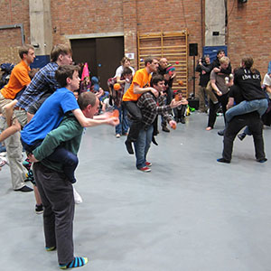

> [!info] Stručný popis
> Varianta hry Gladiátoři v týmech, kde nesený hráč žongluje se třemi míčky, zatímco ho jeho partner pohybuje po aréně.

{ width=300 }

**Velikost skupiny**: 4 až 30 hráčů
**Obtížnost**: Těžká
**Materiál**: Tři žonglovací míčky na pár, vyznačená aréna
**Délka**: přibližně 5–10 minut

## Popis hry

Dvojice vstupují do arény, přičemž jeden hráč nese druhého na zádech. Nesený hráč udržuje tří míčkový vzor, zatímco dvojice se snaží bezpečně vyřadit ostatní týmy.

## Příprava

- Vytvořte páry s jasným souhlasem k nošení.
- Vyznačte malou arénu a držte diváky dál od okrajů.
- Přísně definujte povolené zásahy; nejbezpečnější verze útočí pouze na žonglovací vzor, nikoli na nosiče.

## Pravidla

1. Každý pár začíná s jedním nosičem a jedním žonglérem na zádech.
2. Na signál začne nesený hráč žonglovat se třemi míčky a nosič se pohybuje po aréně.
3. Dvojice se snaží donutit ostatní nesené žongléry upustit míčky a zároveň chrání svůj vlastní vzor.
4. Pár je vyřazen, pokud žonglér upustí míček, jezdec sesedne, nosič se stane nebezpečným, nebo dojde k nepovolenému kontaktu.
5. Poslední pár s aktivním tří míčkovým vzorem vyhrává.

## Varianty

- Použijte pravidla bez kontaktu a bodujte pouze podle výdrže.
- Nechte nosiče střídat po každém kole.
- Použijte žonglování s jedním míčkem pro skupiny s různou úrovní dovedností.

## Bezpečnostní poznámky

Tato hra by měla být považována za pokročilou konvenční hru. Vyhněte se jí s unavenými skupinami, na tvrdých podlahách nebo s nesourodými dvojicemi pro nošení.

## Zdroj

- Karta zdroje UCircus: [3 Ball Piggyback Gladiators](https://ucircus.co.uk/resources-circus-games/)
- Kurzy UCircus: Míčky, Vyřazování, Žonglování
- Lokální zdroj obrázku: `../img/3-ball-piggyback-gladiators.jpg`
- Zpracování zdroje: Nebyl nalezen žádný přesný nezávislý zdroj pravidel; toto je odvozeno z názvu/obrázku UCircus a širšího formátu gladiátorů.
- Další reference: [Žonglérské hry JugglingWorld](https://www.jugglingworld.biz/tricks/juggling-games/)
- Další reference pro kontext gladiátorů/bojů: [Combat (juggling)](https://en.wikipedia.org/wiki/Combat_(juggling))
