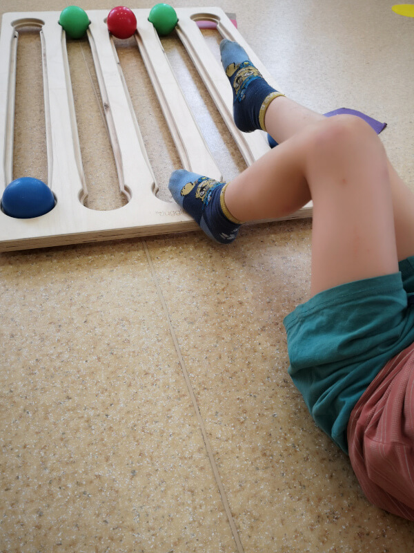

# **Hra s balanční deskou ve školce**

**Mateřská škola Almáskert – III. obvod, Budapešť, Maďarsko**
*Napsala Zsuzsa Székely, specialistka na somatické vzdělávání*

---

## **Úvod**

Před několika lety jsme v **mateřské škole Almáskert** v budapešťské III. městské části hostili krátký workshop, kde se speciální pedagogové, rozvojoví specialisté a zájemci z řad učitelů mateřských škol mohli seznámit se základy **balanční desky (Juggle Board)**. Sama jsem se tohoto školení zúčastnila jako speciální pedagožka a tyto dny pro mě byly nesmírně obohacující a motivující.

Brzy poté vedení školky zakoupilo balanční desku pro každé ze tří pracovišť instituce. Tak začala moje cesta – práce s balanční deskou v mateřské škole, která zahrnuje děti s **různorodými potřebami a speciálními vzdělávacími profily**.

---

## **Jak to začalo**

S balanční deskou jsem začala integrovat **individuální nebo malé skupinové pohybové rozvojové lekce**, které probíhaly v samostatné místnosti během dopoledních hodin. Tyto lekce byly určeny dětem, jejichž individuální vzdělávací plány (dle doporučení odborné komise) zahrnovaly pohybový rozvoj nebo terapii – někdy jako **doplňkový terapeutický nástroj**.

---

{ align=right width=200 }
## **První zkušenosti a funkční využití**

Balanční desku jsem poprvé použila u **dětí s tělesným postižením**, konkrétně k podpoře **funkčního zlepšení**. U jedné dívky byly obě horní končetiny postiženy v důsledku poškození centrálního nervového systému, což ztěžovalo **pohyby flexe v rameni a ruce**. Balanční deska se pro ni stala vzrušujícím novým nástrojem.

Přestože vyžadované pohyby vyžadovaly stejnou míru **soustředění a úsilí** jako u jiných terapeutických nástrojů, skutečnost, že se kuličky **kutálely v pevně daných drážkách** a mohly být uvedeny do pohybu **malými pohyby**, způsobovala, že úspěch byl **dosažitelnější**. To vedlo k silnějšímu pocitu úspěchu.

V tomto případě jsem se nezaměřovala na učení základního vzoru desky. Místo toho jsem se soustředila na její **individuální rozvojové cíle**, jako například:

* Posílení a protažení svalů rukou
* Zlepšení držení těla
* Prevence kompenzačních pohybů

Často jsem jí dovolila vést aktivitu. Všimla jsem si, že tento **pocit kontroly** ji činil nadšenější a vytrvalejší při cvičení.

---

{ align=left width=200 }
## **Přizpůsobení pro zapojení dolních končetin**

V jiném případě jsem pracovala s dítětem, které mělo výrazný **rozdíl v délce nohou**. Balanční desku jsme používali s **nohama**. Naším cílem bylo **aktivovat kratší nohu**, která měla omezený pohyb kvůli ortéze a v běžném životě byla málo využívaná. Poté, co jsme našli správnou polohu, dítě hrálo **pouze postiženou nohou**.

Nebyla to snadná činnost – vyžadovala intenzivní úsilí a vedla k rychlé únavě – ale doprovázelo ji **hodně smíchu a malých vítězství**.

---

## **Povědomí o těle a jeho integrace**

S dítětem, které mělo nedostatečně rozvinuté **povědomí o těle a tělesný obraz**, jsme si s balanční deskou hráli také **pouze nohama**. Toto dítě sotva vnímalo existenci svých nohou a mělo potíže s jejich samostatným pohybem. Instinktivně se snažilo **znovu zapojit ruce** během hry, i když se aktivita soustředila na nohy.

Pomoci mu rozvinout vnímání celého těla – jeho částí, pohybů a polohy v prostoru – bylo pro jeho celkový rozvoj zásadní. Za jeho problémy stála vzácná genetická porucha, která vedla k **velmi nerovnoměrnému kognitivnímu profilu**: vynikající verbální dovednosti, ale slabé soustředění a senzorická integrace.

Nakonec jsme hru rozšířili o **kognitivní výzvy** pomocí stolní hry rukama. Například:

* Vytváření a zapamatování **barevných sekvencí**
* Přiřazení zvířecích identit kuličkám, které musely „vyjít ze svých jeskyní“, když byly zavolány – i když si vyměnily místa

Tyto aktivity se ukázaly jako účinné v kombinaci s jinými nástroji a jasně přispěly k **rozvoji a zrání** dítěte.

---

## **Držení těla a skupinová práce**

Balanční desku používáme také ve **skupinových pohybových rozvojových lekcích**, zejména pro **zlepšení držení těla a posílení zádových svalů**. V těchto případech děti hrají vleže na břiše.

---

{ align=left width=200 }

## **Sociální integrace a pozorování**

Kromě motorického a kognitivního rozvoje jsem si začala všímat potenciálu balanční desky pro posílení **sociální interakce**. Představili jsme ji dětem, které měly **potíže s navazováním spojení** – těm, které bojovaly se vzájemnou pozorností a spoluprací.

Během hry jsem pozorovala:

* Zda se děti podívaly od desky na svého partnera
* Zda si jakýmkoli způsobem vyžádaly kuličku
* Zda vnímaly přítomnost druhého hráče

Pro strukturovanější spolupráci jsme hráli v **trojicích**, kdy dva děti byly na jedné straně desky. Hra zahrnovala **jednoduchá pravidla**, která vyžadovala **společné řešení problémů**, například:

* Jedno dítě mohlo kutálet pouze modré kuličky, druhé pouze zelené
* Kuličky mohly přijít na jakoukoli dráhu
* Musely si navzájem pomáhat s prostorem a načasováním, aniž by se blokovaly

Tyto dynamiky byly **velmi informativní**, jak pro mě jako facilitátora, tak pro pozorovatele.

---

## **Případ kontroly a regulace**

S jedním dítětem – které bylo často v konfliktu s vrstevníky i dospělými – jsme pomocí balanční desky pozorovali a jemně zpochybňovali **chování související s kontrolou**. Toto dítě mělo **silnou potřebu udržovat kontrolu** nad denními rutinami a hrou.

Během hry na desce se zpočátku pokoušelo nenápadně, pak stále zjevněji převzít kontrolu nad lekcí – i když hrálo s jiným dítětem podle strukturovaných pravidel, během několika minut dokázalo převzít kontrolu. Při hře se mnou se často rychle stáhlo, pokud aktivita nebyla plně podle jeho představ.

To představovalo příležitost: prostřednictvím **mikroúprav ve facilitaci** jsme začali budovat momenty, kdy mohlo zůstat ve hře, aniž by ohrozilo svůj pocit autonomie – vytvářejíce tak **rovnováhu mezi strukturou a volbou**.

---

## **Průběžné používání a profesní růst**

Nyní používáme balanční desku po celý akademický rok k hodnocení a posilování:

* Motorických dovedností
* Kognitivních procesů
* Sociálních schopností

V každém případě jsem pozorovala jasné známky růstu a rozvoje u zúčastněných dětí.

Pro mě je neustálý vývoj mé práce s balanční deskou podporován a inspirován účastí na odborných workshopech, kde mohu sdílet zkušenosti, učit se nové přístupy a obnovovat svůj tvůrčí nástrojový arzenál. Kdykoli se cítím zaseknutá nebo příliš ukotvená ve známých vzorcích, tyto workshopy nabízejí nové perspektivy a novou energii – pomáhají mi vrátit se do třídy osvěžená a znovu inspirovaná.
