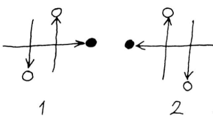

### Podvádění!
Zdroj: [Kaskáda 001](Kaskade%20001.md#Schummeln!)

Pokud máte fosforeskující míčky, které ve tmě svítí, můžete u publika vyvolat dojem, že provádíte sloupovou formaci. Najednou jeden z dvojitých míčků (ten, který držíte) neuvěřitelně zůstane viset ve vzduchu a odmítá spadnout. (Vy ho prostě držíte, ale divák to nevidí!) Odpadlík, který zjevně překonal zákony gravitace, teď může předvádět úžasné akrobatické triky, než se opět zařadí do vzoru. Například:

#### Jojo

"Podvodný míček" držíte vždy pár centimetrů nad jedním z odražených míčků. Pohybujte rukou nahoru a dolů, takže vzdálenost mezi drženým a letícím míčkem zůstává stále stejná. Vypadá to, jako by míčky byly spojené provázkem.

#### Kyvadlo

Toto je také trik s jojem, při kterém se ruce při držení podvodného míčku střídají. Jeden míček se odráží svisle uprostřed nahoru a dolů, zatímco podvodné míčky se zjevně "táhnou" sem a tam a vaše paže dělají kmitavé pohyby kyvadla. (Přitom byste mohli střídavě kmitat i nohama nebo říkat "tik-tak".)

{ align=left }

**Přepis obrázku**

(i) A držet v levé ruce
B vyhodit z pravé
C chytit pravou

(ii) C vyhodit z pravé
B chytit pravou
A a B přenést na pravou stranu

(iii) B držet v pravé
A vyhodit z levé
C chytit levou

**Zde je několik ještě vzdorovitějších triků pro podvodný míček:**
#### Kosa

Podvodný míček sviští vodorovně tam a zpět mezi dvěma vyhozenými míčky, nejprve nad klesajícím, pak pod stoupajícím míčkem. Ruka, ve které držíte podvodný míček, "prosekává" žonglování se 2 míčky jako kosa.

Elegantnější (a snazší) variantou je "nekonečná kosa". Podvodný míček nepopisuje rovnou vodorovnou linii, ale znaménko nekonečna (nebo ležatou osmičku).

#### Orbita

Zvlášť vzdorovitý podvodný míček možná začne kroužit kolem vaší hlavy jako otravná moucha. (Bzz, bzz!)

Jelikož ve skutečnosti žonglujete jen se 2 míčky a třetí jen držíte, počet triků, které tento třetí míček může provádět, není ničím omezen, kromě vaší anatomie!
