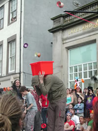

> [!info] Stručný popis
> Cílová hra, při které se hráči snaží hodit diabolom do krabice nebo koše.

{ width=300 }

**Počet hráčů**: 2 až 40 hráčů  
**Obtížnost**: snadná  
**Materiál**: Diabola, hůlky, krabice nebo koš  
**Délka**: cca 5-10 minut

## Popis hry

Hráči stojí za odhodovou linií, roztočí svá diabola a pokusí se je hodit do krabice, kyblíku nebo koše umístěného na druhém konci sálu. Hody mohou probíhat jeden po druhém nebo na společný signál.

Diabolo se počítá, pokud dopadne do cíle a zůstane v něm. Úspěšné hody bodují nebo posílají hráče do dalšího kola. Pro vytvoření finále zvyšte vzdálenost, zmenšete velikost cíle nebo vyžadujte několik úspěšných hodů.

## Příprava

- Umístěte krabici nebo koš v přiměřené vzdálenosti od odhodové linie.
- Zajistěte všem hráčům dostatek prostoru pro bezpečné házení.
- Rozhodněte, zda hráči házejí jeden po druhém, nebo všichni najednou.

## Varianty

- Použijte týmy a sčítejte celkový počet úspěšných hodů.
- Začátečníky nechte stát blíže a pokročilé hráče dále.
- Použijte několik cílů s různou bodovou hodnotou.

## Bezpečnostní pokyny

Pevný cíl je nejbezpečnější. Vyhněte se cílům drženým lidmi, pokud s tím všichni zúčastnění výslovně nesouhlasili a hody jsou kontrolované.

## Zdroj

- [JugglingWorld - Juggling Games](https://www.jugglingworld.biz/tricks/juggling-games/), sekce: Diabolo Games, název: Diabolo in a box.
- [Stránka s cirkusovými hrami UCircus](https://ucircus.co.uk/resources-circus-games/), karta zdroje: Diabolo Box Throw.
- Kurzy UCircus: Diabolo.
- Referenční obrázek JugglingWorld: `../img/game-diabolo-in-box.jpg`.
- Referenční obrázek UCircus: `../img/diabolo-box-throw.jpg`.
