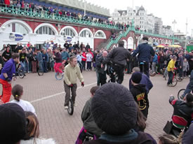

> [!info] Stručný popis
> Vyřazovací hra, ve které se cyklisté na jednokolce snaží udržet na stroji a zároveň donutit ostatní seskočit.

{ width=300 }

**Počet hráčů**: 4 až 60
**Obtížnost**: těžká
**Materiál**: Jednokolky, vyznačená aréna
**Doba trvání**: cca 5-15 minut

## Popis hry

Cyklisté na jednokolce jezdí uvnitř vyznačené arény. Cílem je zůstat na jednokolce déle než všichni ostatní a zároveň vyvíjet kontrolovaný tlak na ostatní jezdce.

Jezdec je vyřazen, pokud seskočí, dotkne se země nohou nebo rukou, opustí arénu nebo použije nepovolený kontakt. Vyřazení jezdci okamžitě opustí arénu. Poslední jezdec, který zůstane na jednokolce, vítězí.

## Příprava

- Vyznačte jasnou jezdeckou plochu s dostatkem prostoru po okrajích.
- Před začátkem kola se dohodněte na pravidlech kontaktu.
- Ujistěte se, že všichni účastníci umí sebevědomě jezdit, než se zapojí.

## Varianty

- Hrajte verzi bez kontaktu pro začátečníky, kde jezdci mohou pouze blokovat prostor, nikoli se dotýkat.
- Použijte týmové barvy a počítejte body pro tým posledního zbývajícího jezdce.
- Zmenšete arénu mezi koly pro zkušené jezdce.

## Bezpečnostní pokyny

Používejte pouze s jistými jezdci na jednokolce. Jasně definujte limity kontaktu. Pro veřejné použití omezte kontakt na lehký tlak ramenem nebo paží a zakazte chytání, blokování kol a tělesné nárazy.

## Zdroj

- [JugglingWorld - Juggling Games](https://www.jugglingworld.biz/tricks/juggling-games/), sekce: Gladiators.
- [Stránka s cirkusovými hrami UCircus](https://ucircus.co.uk/resources-circus-games/), karta zdroje: Unicycle Gladiators.
- Kurzy UCircus: Jednokolka, Rovnováha.
- Referenční obrázek JugglingWorld: `../img/game-ewan-unicycle-gladiators.jpg`.
- Referenční obrázek UCircus: `../img/unicycle-gladiators.jpg`.
