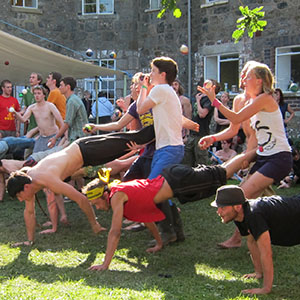

> [!info] Kurzbeschreibung
> Ein Rennen für drei Personen, bei dem zwei Träger eine menschliche Schubkarre steuern und gleichzeitig einen gemeinsamen Drei-Ball-Kaskadenwurf aufrechterhalten.

{ width=300 }

**Gruppengröße**: 3 bis 60 Spieler
**Schwierigkeitsgrad**: mittel
**Material**: Drei Jonglierbälle pro Team, Kursmarkierungen
**Dauer**: ca. 5-15 Minuten

## Spielbeschreibung

Teams bestehen aus drei Spielern. Ein Spieler ist die menschliche Schubkarre und stützt sich auf den Händen ab. Die beiden anderen Spieler halten jeweils ein Bein des Schubkarrenspielers.

Während sie die Schubkarre ins Ziel steuern, werfen die beiden stehenden Spieler eine gemeinsame Drei-Ball-Kaskade zwischen sich. Das Team muss sich als Einheit bewegen, ohne die Bälle fallen zu lassen oder die Schubkarrenposition zusammenbrechen zu lassen. Das schnellste Team mit einem fehlerfreien Lauf gewinnt.

## Aufbau

- Markiere einen kurzen, geraden Kurs mit Start- und Ziellinie.
- Bilde Teams aus drei Personen.
- Lass jedes Team die Schubkarrenposition testen, bevor das Jongliermuster hinzugefügt wird.
- Starte die Teams einzeln, in Bahnen oder in Läufen, je nach verfügbarem Platz.

## Regeln

1. Der Schubkarrenspieler beginnt in der Stützposition auf den Händen, während die beiden Träger jeweils ein Bein halten.
2. Die Träger beginnen die gemeinsame Drei-Ball-Kaskade.
3. Auf das Startsignal bewegt sich das Team in Richtung Ziellinie, während die Kaskade aktiv gehalten wird.
4. Ein Team muss neu starten oder scheidet aus, wenn die Bälle fallen gelassen werden, die Schubkarrenposition zusammenbricht, ein Träger loslässt oder das Team die Bahn verlässt.
5. Der schnellste fehlerfreie Lauf gewinnt.

## Variationen

- Verkürze den Kurs für jüngere oder weniger fitte Gruppen.
- Erlaube einen Ein- oder Zwei-Ball-Austausch, bevor ein vollständiger Drei-Ball-Kaskadenwurf versucht wird.
- Verwende eine Distanzherausforderung anstelle eines Rennens: Wie weit kann das Team fehlerfrei reisen?
- Lass die Teammitglieder nach jeder Runde die Rollen wechseln.

## Sicherheitshinweise

Halte den Kurs kurz und verwende eine weiche, saubere Oberfläche. Stoppe sofort, wenn Handgelenke, Schultern oder Rücken überlastet sind. Erlaube den Teams nicht, nebeneinander zu rennen, es sei denn, die Bahnen sind breit genug, um Kollisionen zu vermeiden.

## Quelle

- [JugglingWorld - Juggling Games](https://www.jugglingworld.biz/tricks/juggling-games/), Abschnitt: Ball Games, Titel: 3 person wheelbarrow race.
- [UCircus circus games page](https://ucircus.co.uk/resources-circus-games/), Source Card: Wheelbarrow Juggling.
- UCircus Kurse: Jonglage.
- UCircus Referenzbild: `../img/wheelbarrow-juggling.jpg`.
