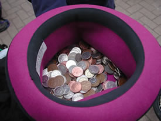

> [!info] Kurzbeschreibung
> Jeder Spieler gibt drei Münzen ab und jongliert diese.

{ width=300 }

**Gruppengröße**: 2 bis 40 Spieler
**Schwierigkeitsgrad**: mittel
**Material**: Drei Münzen pro Spieler, Sammelhut
**Dauer**: ca. 5-15 Minuten

## Spielbeschreibung

Jeder Spieler gibt drei Münzen ab und jongliert diese. Wenn ein Spieler eine Münze fallen lässt, legt er seine Münzen in einen zentralen Hut oder Topf. Der letzte Spieler, der noch jongliert, gewinnt die gesammelten Münzen.

## Variationen

Verwenden Sie für Kinder oder öffentliche Workshops Tokens anstelle von echtem Geld.

## Sicherheitshinweise

Halten Sie den Spielbereich frei und definieren Sie die Grenzen, bevor die Runde beginnt. Bei Körperkontaktsspielen zielen Sie auf Requisiten statt auf Körper. Bei Wurf-, Reit-, Balance- oder akrobatischen Spielen lassen Sie genügend Platz für Fehlschläge und beenden Sie die Runde, wenn die Gruppe beginnt, unsichere Risiken einzugehen.

## Quelle

[JugglingWorld - Juggling Games](https://www.jugglingworld.biz/tricks/juggling-games/), Abschnitt: Miscellaneous!.
