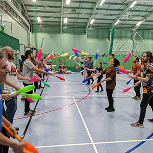

> [!info] Σύντομη Περιγραφή
> Μια πρόκληση απόστασης όπου ζογκλέρ ή ζευγάρια προσπαθούν να διατηρήσουν το ζογκλερικό με ρόπαλα/πάσες ζωντανό σε αυξανόμενη απόσταση.

{ width=300 }

**Μέγεθος Ομάδας**: 2 έως 40 παίκτες
**Δυσκολία**: μέτρια
**Υλικά**: Ρόπαλα ζογκλερικής, δείκτες απόστασης
**Διάρκεια**: περίπου 5-15 λεπτά

## Περιγραφή Παιχνιδιού

Οι παίκτες δοκιμάζουν πόση απόσταση μπορούν να δημιουργήσουν, διατηρώντας παράλληλα ελεγχόμενες τις ρίψεις των ροπάλων. Ο τίτλος UCircus υποδηλώνει μια παραλλαγή με τρία ρόπαλα· το πλησιέστερο τεκμηριωμένο παιχνίδι κανόνων είναι το πάσα ροπάλων σε μεγάλη απόσταση.

## Στήσιμο

- Σημειώστε μια γραμμή εκκίνησης και δείκτες απόστασης.
- Αποφασίστε αν το παιχνίδι θα παιχτεί ατομικά ή σε ζευγάρια.
- Δώστε στους παίκτες έναν σύντομο γύρο εξάσκησης για να συμφωνήσουν στο ύψος της ρίψης και την κίνηση.

## Κανόνες

1. Οι παίκτες ή τα ζευγάρια ξεκινούν από την αρχική απόσταση.
2. Στην εκδοχή για ζευγάρια, οι σύντροφοι πασάρουν ρόπαλα και απομακρύνονται, διατηρώντας το μοτίβο ζωντανό.
3. Στην ατομική εκδοχή, ένας παίκτης κάνει μια μακρινή ρίψη, κινείται για να την πιάσει και συνεχίζει το ζογκλερικό.
4. Μια πτώση ή αποτυχημένο πιάσιμο τερματίζει την προσπάθεια και καθορίζει την τελική απόσταση.
5. Η μεγαλύτερη καθαρή απόσταση κερδίζει.

## Παραλλαγές

- Χρησιμοποιήστε μπάλες ή στεφάνια για ομάδες με μικτές δεξιότητες.
- Βαθμολογήστε με τη μέγιστη απόσταση μετά από τρεις προσπάθειες.
- Διεξάγετε μια συνεργατική εκδοχή όπου η ομάδα προσπαθεί να σπάσει ένα κοινό ρεκόρ απόστασης.

## Σημειώσεις Ασφαλείας

Οι μακρινές ρίψεις ροπάλων μπορεί να ταξιδέψουν απρόβλεπτα. Διατηρήστε τον χώρο ρίψης καθαρό.

## Πηγή

- Κάρτα πηγής UCircus: [3 Club Distance Juggling](https://ucircus.co.uk/resources-circus-games/)
- Μαθήματα UCircus: Ρόπαλα, Knockout, Ζογκλερικό
- Εικόνα τοπικής πηγής: `../img/3-club-distance-juggling.jpg`
- Διαχείριση πηγής: Μερικώς υποστηριζόμενη από περιγραφές πάσας ροπάλων σε μεγάλη απόσταση· η ακριβής παραλλαγή τριών ροπάλων του UCircus χρειάζεται επιβεβαίωση.
- Πρόσθετη αναφορά: [JugglingWorld juggling games](https://www.jugglingworld.biz/tricks/juggling-games/)
- Πρόσθετη αναφορά για πλαίσιο μονομάχων/μάχης: [Combat (juggling)](https://en.wikipedia.org/wiki/Combat_(juggling))
