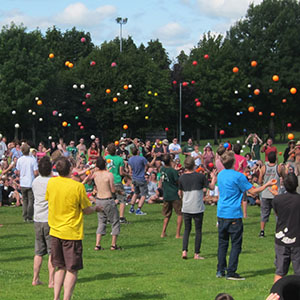

> [!info] Σύντομη Περιγραφή
> Ένας αγώνας αντοχής με πέντε μπάλες, όπου ο τελευταίος ενεργός ζογκλέρ κερδίζει.

{ width=300 }

**Μέγεθος Ομάδας**: 2 έως 80 παίκτες
**Δυσκολία**: μέτρια
**Υλικά**: Πέντε μπάλες ζογκλερικής ανά παίκτη
**Διάρκεια**: περίπου 3-15 λεπτά

## Περιγραφή Παιχνιδιού

Όλοι οι παίκτες ξεκινούν να κάνουν ζογκλερική με πέντε μπάλες ταυτόχρονα. Όποιος ρίξει, μαζέψει, ξαναρχίσει ή σταματήσει το συμφωνημένο μοτίβο των πέντε μπαλών, βγαίνει εκτός. Οι αποκλεισμένοι παίκτες αποχωρούν ήσυχα από τον ενεργό χώρο, ώστε οι εναπομείναντες ζογκλέρ να έχουν αρκετό χώρο.

Ο τελευταίος παίκτης που συνεχίζει να κάνει ζογκλερική κερδίζει. Αν παραμείνουν πολλοί δυνατοί ζογκλέρ για μεγάλο χρονικό διάστημα, ορίστε ένα χρονικό όριο και προχωρήστε σε έναν τελικό γύρο με επιπλέον εργασίες.

## Προετοιμασία

- Δώστε σε κάθε παίκτη αρκετό χώρο για ζογκλερική με πέντε μπάλες.
- Συμφωνήστε αν επιτρέπεται οποιοδήποτε μοτίβο πέντε μπαλών ή αν απαιτείται η "καταρράκτης" (cascade).
- Αποφασίστε αν το παιχνίδι είναι με αποκλεισμό ή μια πρόκληση αντοχής για προσωπική επίδοση.

## Παραλλαγές

- Προσθέστε απαιτούμενα κόλπα ή κινήσεις μετά από σταθερό χρόνο.
- Διοργανώστε προκριματικούς γύρους και έναν τελικό για μεγάλες ομάδες.
- Χρησιμοποιήστε την ίδια μορφή για άλλους αριθμούς ή αντικείμενα.

## Σημειώσεις Ασφαλείας

Αυτό το παιχνίδι έχει χαμηλή επαφή, αλλά οι πτώσεις πέντε μπαλών εξαπλώνονται γρήγορα. Κρατήστε τους θεατές και τους αποκλεισμένους παίκτες έξω από τον ενεργό χώρο ζογκλερικής.

## Πηγή

- [JugglingWorld - Juggling Games](https://www.jugglingworld.biz/tricks/juggling-games/), ενότητα: Endurance Games/World Records.
- [UCircus circus games page](https://ucircus.co.uk/resources-circus-games/), κάρτα πηγής: 5 Ball Endurance.
- Μαθήματα UCircus: Μπάλες, Knockout, Αντοχή, Ζογκλερική.
- Εικόνα αναφοράς UCircus: `../img/5-ball-endurance.jpg`.
