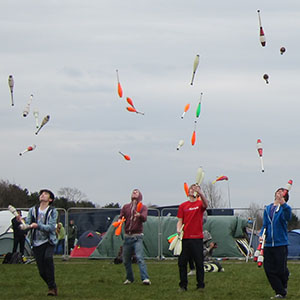

> [!info] Σύντομη Περιγραφή
> Ένα παιχνίδι αντοχής με αριθμούς υψηλής δεξιότητας για ζογκλέρ με επτά μπαστούνια.

{ width=300 }

**Μέγεθος Ομάδας**: 2 έως 30 παίκτες
**Δυσκολία**: Δύσκολο
**Υλικό**: Επτά μπαστούνια ζογκλερικής ανά παίκτη
**Διάρκεια**: περίπου 3-15 λεπτά

## Περιγραφή Παιχνιδιού

Οι παίκτες προσπαθούν να κρατήσουν επτά μπαστούνια στον αέρα για όσο το δυνατόν μεγαλύτερο χρονικό διάστημα. Η μεγαλύτερη επαληθευμένη επίδοση κερδίζει.

## Προετοιμασία

- Χρησιμοποιήστε έναν πολύ ανοιχτό χώρο με σαφή διαχωρισμό μεταξύ των ζογκλέρ.
- Ορίστε την έναρξη: ταυτόχρονη έναρξη, παράθυρο έναρξης ή ατομικές προσπάθειες.
- Ορίστε κριτές ή χρησιμοποιήστε βίντεο εάν η ακριβής χρονομέτρηση είναι σημαντική.

## Κανόνες

1. Οι παίκτες ξεκινούν τη ζογκλερική με επτά μπαστούνια σύμφωνα με τον συμφωνημένο κανόνα έναρξης.
2. Η προσπάθεια συνεχίζεται εφόσον διατηρούνται επτά μπαστούνια στο συμφωνημένο μοτίβο.
3. Μια πτώση, συλλογή, επανεκκίνηση ή μείωση κάτω από επτά τερματίζει την προσπάθεια.
4. Νικητής είναι ο παίκτης με τη μεγαλύτερη συνεχή επαληθευμένη επίδοση.
5. Εάν πολλοί παίκτες ξεπεράσουν το χρονικό όριο, διεξάγετε έναν τελικό ή ανακηρύξτε συν-νικητές.

## Παραλλαγές

- Χρησιμοποιήστε ατομικές προσπάθειες για ασφάλεια και σαφέστερη κρίση.
- Διεξάγετε μια εκδοχή εργαστηρίου για προσωπικό ρεκόρ.
- Απαιτήστε μια καθαρή συλλογή μετά την επίδοση για προχωρημένη βαθμολογία.

## Σημειώσεις Ασφαλείας

Αυτό απευθύνεται μόνο σε προχωρημένους ζογκλέρ. Τα επτά μπαστούνια απαιτούν σημαντικό ύψος και πλευρικό χώρο.

## Πηγή

- Κάρτα πηγής UCircus: [7 Club Endurance](https://ucircus.co.uk/resources-circus-games/)
- Μαθήματα UCircus: Clubs, Knockout, Endurance, Juggling
- Τοπική εικόνα πηγής: `../img/7-club-endurance.jpg`
- Χειρισμός πηγής: Υποστηρίζεται από το UCircus και γενικές περιγραφές παιχνιδιών συμβάσεων για αριθμούς/αντοχή.
- Πρόσθετη αναφορά: [JugglingWorld juggling games](https://www.jugglingworld.biz/tricks/juggling-games/)
- Πρόσθετη αναφορά για πλαίσιο μονομάχων/μάχης: [Combat (juggling)](https://en.wikipedia.org/wiki/Combat_(juggling))
