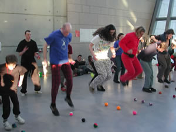

> [!info] Σύντομη Περιγραφή
> Ένας αγώνας συνεργασίας όπου ο ένας παίκτης πετάει μπάλες από το πάτωμα προς τα πάνω και ο άλλος τις πιάνει.

{ width=300 }

**Μέγεθος Ομάδας**: 2 έως 40 παίκτες
**Δυσκολία**: εύκολο
**Υλικά**: Πέντε μπάλες ανά ομάδα, προαιρετικά κάδος ή σακούλα
**Διάρκεια**: περίπου 5-15 λεπτά

## Περιγραφή Παιχνιδιού

Παιχνίδι συνεργασίας για ομάδες των δύο ατόμων. Πέντε μπάλες τοποθετούνται σε μια σειρά στο πάτωμα. Ο ένας παίκτης πετάει ή κλωτσάει τις μπάλες από το έδαφος προς τα πάνω, ενώ ο συμπαίκτης του τις πιάνει με το χέρι ή μέσα σε ένα δοχείο. Η ομάδα που θα πιάσει όλες τις μπάλες γρηγορότερα κερδίζει.

## Παραλλαγές

Οι ρόλοι μπορούν να αλλάξουν μετά την πρώτη σειρά με τις μπάλες. Για μια μεγαλύτερη σκυταλοδρομία, στήστε δύο σειρές ώστε και οι δύο παίκτες να πρέπει να είναι μία φορά ο πετατής και μία φορά ο πιάνων.

## Σημειώσεις Ασφαλείας

Διατηρήστε τον χώρο παιχνιδιού καθαρό και ορίστε τα όρια πριν ξεκινήσει ο γύρος. Για παιχνίδια επαφής, στοχεύστε σε αντικείμενα και όχι σε σώματα. Για παιχνίδια ρίψης, ισορροπίας ή ακροβατικά, αφήστε αρκετό χώρο για αποτυχημένες προσπάθειες και σταματήστε τον γύρο εάν η ομάδα αρχίσει να παίρνει επικίνδυνα ρίσκα.

## Πηγή

[JugglingWorld - Juggling Games](https://www.jugglingworld.biz/tricks/juggling-games/), ενότητα: Ball Games.
