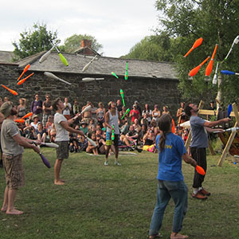

> [!info] Short Description
> A numbers-juggling endurance contest where players keep five clubs going as long as possible.

{ width=300 }

**Group Size**: 2 to 40 players
**Difficulty**: schwer
**Material**: Five juggling clubs per player
**Duration**: approx. 3-15 minutes

## Game Description

All players start five-club juggling together. The winner is the last player still maintaining the agreed pattern.

## Setup

- Use a large open space with enough distance between jugglers.
- Agree whether any five-club pattern is allowed or only a cascade/fountain-style pattern.
- Position judges so drops are visible.

## Rules

1. Players start five clubs on the signal.
2. A player remains active while five clubs are continuously in the agreed pattern.
3. A drop, collection, restart, or reduction of the number ends the attempt.
4. Eliminated players step back from the active area.
5. The longest remaining run wins.

## Variations

- Use timed heats if many advanced jugglers enter.
- Require tricks or movement after a fixed time.
- Allow personal best attempts instead of elimination for workshops.

## Safety Notes

Five-club runs need space. Keep spectators and eliminated players outside the landing area.

## Source

- UCircus source card: [5 Club Endurance](https://ucircus.co.uk/resources-circus-games/)
- UCircus classes: Clubs, Knockout, Endurance, Juggling
- Local source image: `../img/5-club-endurance.jpg`
- Source handling: Supported by UCircus and independent convention-game descriptions of numbers/endurance competitions.
- Additional reference: [JugglingWorld juggling games](https://www.jugglingworld.biz/tricks/juggling-games/)
- Additional reference for gladiators/combat context: [Combat (juggling)](https://en.wikipedia.org/wiki/Combat_(juggling))
