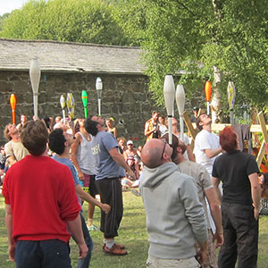

> [!info] Short Description
> A balance endurance game where players keep a juggling club balanced on the head or face.

{ width=300 }

**Group Size**: 2 to 40 players
**Difficulty**: mittel
**Material**: One juggling club per player
**Duration**: approx. 3-10 minutes

## Game Description

Players balance a club on the agreed body point. The last player still balancing wins.

## Setup

- Give each player one club.
- Choose the balance point: forehead, chin, nose, or top of the head.
- Decide whether players may move their feet or must stay still.

## Rules

1. All players place the club in the agreed balance position.
2. On the signal, hands move away and the balance begins.
3. A player is out when the club falls, is caught, or is touched illegally.
4. Players still active may be asked to walk, turn, kneel, or move through a simple course.
5. The last player still balancing wins.

## Variations

- Add a water cup on top for a silly advanced version.
- Run a balance race instead of an endurance round.
- Use scarves or sticks for beginner groups.

## Safety Notes

Keep enough space between players so falling clubs do not hit faces. Avoid hard clubs for very young groups.

## Source

- UCircus source card: [Club Head Balance](https://ucircus.co.uk/resources-circus-games/)
- UCircus classes: Clubs, Knockout, Balance
- Local source image: `../img/club-head-balance.jpg`
- Source handling: Supported by UCircus and independent descriptions of club/face-balance convention games.
- Additional reference: [JugglingWorld juggling games](https://www.jugglingworld.biz/tricks/juggling-games/)
- Additional reference for gladiators/combat context: [Combat (juggling)](https://en.wikipedia.org/wiki/Combat_(juggling))
