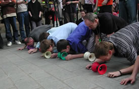

> [!info] Short Description
> All diabolos start on the ground at a start line.

{ width=300 }

**Group Size**: 2 to 40 players  
**Difficulty**: einfach  
**Material**: Diabolos, start and finish line  
**Duration**: approx. 5-15 minutes

## Game Description

All diabolos start on the ground at a start line. Players may move their diabolo only by pushing it with their nose. The first player to roll their diabolo across the finish line wins.

## Variations

Use heats for large groups. Keep the course short and silly rather than physically exhausting.

## Safety Notes

Keep the playing area clear and define the limits before the round starts. For contact games, target props rather than bodies. For throwing, riding, balancing or acrobatic games, leave enough space for failed attempts and stop the round if the group starts taking unsafe risks.

## Source

[JugglingWorld - Juggling Games](https://www.jugglingworld.biz/tricks/juggling-games/), section: Diabolo Games.
