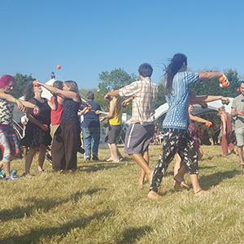

> [!info] Descripción Breve
> Un juego de eliminación de malabares temático donde malabaristas de tres pelotas intentan sobrevivir a una persecución al estilo zombi.

{ width=300 }

**Tamaño del grupo**: 5 a 40 jugadores
**Dificultad**: media
**Material**: Tres pelotas de malabares por jugador activo, área delimitada
**Duración**: aprox. 5-10 minutos

## Descripción del Juego

Los jugadores hacen malabares con tres pelotas mientras evitan la presión de los zombis. El juego combina resistencia en los malabares, "la traes" (tag) y una temática de terror lúdica.

## Preparación

- Delimita el área de juego.
- Elige uno o varios zombis iniciales.
- Define los límites de movimiento de los zombis, como caminar despacio, brazos extendidos o no correr.

## Reglas

1. Todos los jugadores que no son zombis comienzan a hacer malabares con tres pelotas.
2. Los zombis se mueven por el área e intentan tocar o presionar a los malabaristas dentro de los límites acordados.
3. Un malabarista se convierte en zombi o es eliminado cuando se le cae una pelota, sale del área o es tocado legalmente.
4. La ronda continúa hasta que quede un malabarista que no sea zombi o todos los jugadores se hayan convertido en zombis.
5. El último malabarista superviviente gana, o los zombis ganan si todos son convertidos.

## Variaciones

- Usa la conversión en lugar de la eliminación para que todos sigan jugando.
- Deja que los zombis no lleven ningún accesorio para la seguridad de los principiantes.
- Exige a los zombis hacer malabares con una pelota para una versión avanzada.

## Notas de Seguridad

Mantén los movimientos de los zombis lentos y predecibles. No permitas agarrar, placar o sustos repentinos en grupos concurridos.

## Fuente

- Tarjeta de fuente de UCircus: [3 Ball Zombie Knockout](https://ucircus.co.uk/resources-circus-games/)
- Clases de UCircus: Pelotas, Eliminación, Malabares
- Imagen de fuente local: `../img/3-ball-zombie-knockout.jpg`
- Manejo de la fuente: No se encontró una fuente de reglas independiente exacta; este borrador se infiere del título y la imagen de UCircus.
- Referencia adicional: [Juegos de malabares de JugglingWorld](https://www.jugglingworld.biz/tricks/juggling-games/)
- Referencia adicional para contexto de gladiadores/combate: [Combat (juggling)](https://en.wikipedia.org/wiki/Combat_(juggling))
