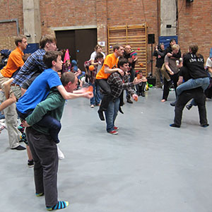

> [!info] Rövid leírás
> A "Gladiátorok" csapatszintű játék egy olyan változata, ahol az egyik játékos három labdát dobál, miközben a társa mozgatja őt a pályán.

{ width=300 }

**Csoportméret**: 4–30 játékos
**Nehézség**: nehéz
**Anyag**: Három zsonglőrlabda párként, kijelölt pálya
**Időtartam**: kb. 5–10 perc

## Játék leírása

A párok úgy lépnek be a pályára, hogy az egyik játékos a hátán viszi a másikat. A hátán lévő játékos folyamatosan három labdát dobál, miközben a párok megpróbálják biztonságosan kiütni a többi csapatot.

## Előkészületek

- Alakítsanak párokat, a hordozásba való beleegyezés legyen egyértelmű.
- Jelöljenek ki egy kis pályát, és tartsák távol a nézőket a szélektől.
- A megengedett beavatkozásokat nagyon szigorúan határozzák meg; a legbiztonságosabb változat csak a zsonglőrködést támadja, nem a hordozót.

## Szabályok

1. Minden pár egy hordozóval és egy hátán ülő zsonglőrrel kezd.
2. A jelzésre a hátán ülő játékos elkezdi dobálni a három labdát, a hordozó pedig mozogni kezd a pályán.
3. A párok megpróbálják leejteni a többi hátán ülő zsonglőr labdáit, miközben védik saját mintájukat.
4. Egy pár kiesik, ha a zsonglőr leejti a labdát, a hordozott leesik, a hordozó veszélybe kerül, vagy tiltott érintkezés történik.
5. Az utolsó, aktív háromlabdás mintával rendelkező pár nyer.

## Változatok

- Alkalmazzanak érintésmentes szabályokat, és csak kitartás alapján pontozzon.
- A hordozók minden kör után cseréljenek helyet.
- Használjanak egylabdás zsonglőrködést vegyes szintű csoportok számára.

## Biztonsági megjegyzések

Ezt egy haladó szintű, konvenciós játékként kell kezelni. Kerüljék fáradt csoportokkal, kemény padlóval vagy nem egyforma erősségű hordozó párokkal.

## Forrás

- UCircus forráskártya: [3 Ball Piggyback Gladiators](https://ucircus.co.uk/resources-circus-games/)
- UCircus órák: Labdák, Kiütés, Zsonglőrködés
- Helyi forráskép: `../img/3-ball-piggyback-gladiators.jpg`
- Forráskezelés: Nem találtunk pontos, független szabályforrást; ez az UCircus címéből/képéből és az általános gladiátorformátumból következtethető.
- További referencia: [JugglingWorld zsonglőrjátékok](https://www.jugglingworld.biz/tricks/juggling-games/)
- További referencia a gladiátorok/harci kontextushoz: [Combat (juggling)](https://en.wikipedia.org/wiki/Combat_(juggling))
