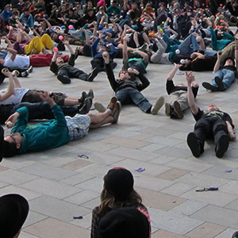

> [!info] Rövid leírás
> Egy parancs-reakció játék, ahol az ördögbalta-játékosok csak az érvényes "Simon mondja" utasításokat követik, miközben három labdát tartanak mozgásban.

{ width=300 }

**Csoportméret**: 3–50 játékos
**Nehézség**: közepes
**Anyag**: Játékosonként három ördögbalta
**Időtartam**: kb. 5–10 perc

## Játék leírása

Minden játékos három ördögbaltával dobál, miközben egy "hívó" mozgási vagy trükk utasításokat ad. A játékosok csak azokat az utasításokat követik, amelyek az előre megbeszélt fordulatokkal kezdődnek, például "Simon mondja". Aki hamis parancsot követ, elmulaszt egy érvényes parancsot, leejti a labdát, vagy abbahagyja a dobálást, az kiesik.

A lehetséges parancsok közé tartozik a megfordulás, leülés, lefekvés, felállás, tapsolás, minta váltása, balra vagy jobbra mozgás, vagy megdermedés.

## Előkészületek

- Adj minden játékosnak három labdát és elegendő személyes teret.
- Válassz egy hívót.
- Beszéljétek meg, hogy a játékosok kiesnek-e, vagy vicces büntetőpontokat kapnak.

## Változatok

- Kezdőknek használj egy labdát vagy sálat.
- Tedd kooperatívvá a játékot azzal, hogy megszámoljátok, hány parancsot tud túlélni az egész csoport.
- Hagyd, hogy a kiesett játékosok segédhívókká váljanak.

## Biztonsági megjegyzések

Kerüld azokat a parancsokat, amelyek arra kényszerítik a játékosokat, hogy leüssék magukat, egymásba rohanjanak, vagy vakon mozogjanak, miközben a kellékeiket figyelik.

## Forrás

- [JugglingWorld - Juggling Games](https://www.jugglingworld.biz/tricks/juggling-games/), szakasz: Ball Games, cím: Simon Says.
- [UCircus circus games page](https://ucircus.co.uk/resources-circus-games/), forráskártya: 3 Ball Simon Says.
- UCircus órák: Balls, Knockout, Juggling.
- UCircus referencia kép: `../img/3-ball-simon-says.jpg`.
