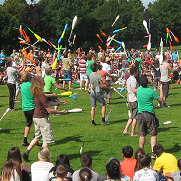

> [!info] Breve Descrizione
> Il classico gioco di combattimento a convention in cui giocolieri con clave cercano di essere l'ultima persona a giocolare.

{ width=300 }

**Numero di partecipanti**: da 3 a 80 giocatori
**Difficoltà**: difficile
**Materiale**: Tre clave per giocatore, arena delimitata
**Durata**: circa 5-15 minuti

## Descrizione del Gioco

Tutti giocolano tre clave nella stessa arena. I giocatori attaccano i pattern di giocoleria degli avversari mantenendo vivo il proprio.

## Preparazione

- Delimitare chiaramente un'arena con spazio sufficiente per l'uscita sicura dei giocatori eliminati.
- Concordare che gli attacchi mirano agli attrezzi, non ai corpi.
- Includere solo giocatori in grado di mantenere un pattern stabile di tre clave durante il movimento.

## Regole

1. Tutti i giocatori iniziano a giocolare tre clave contemporaneamente.
2. I giocatori si muovono nell'arena e cercano di far cadere le clave agli avversari disturbando i loro pattern.
3. Un giocatore è eliminato quando lascia cadere, raccoglie, smette di giocolare o non ha più le tre clave richieste nel pattern.
4. I giocatori eliminati smettono immediatamente di interferire ed escono dal campo.
5. L'ultimo giocatore che giocolare vince il round.

## Varianti

- Organizzare gladiatori a squadre e assegnare punti alla squadra del vincitore.
- Aggiungere regole di handicap per i giocatori molto abili.
- Introdurre una regola di "nessun contatto fisico" per un gioco misto più sicuro.

## Note sulla Sicurezza

Il regolamento pubblico dovrebbe vietare esplicitamente gli attacchi ai corpi e i lanci pericolosi verso i volti.

## Fonte

- Scheda UCircus: [Club Gladiators](https://ucircus.co.uk/resources-circus-games/)
- Classi UCircus: Clave, Knockout, Giocoleria
- Immagine locale: `../img/club-gladiators.jpg`
- Gestione della fonte: Ben supportato da fonti su combattimento/gladiatori e dall'immagine/scheda UCircus.
- Riferimento aggiuntivo: [Giochi di giocoleria JugglingWorld](https://www.jugglingworld.biz/tricks/juggling-games/)
- Riferimento aggiuntivo per il contesto gladiatori/combattimento: [Combat (juggling)](https://en.wikipedia.org/wiki/Combat_(juggling))
