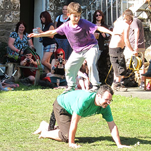

> [!info] Descrizione Breve
> Un gioco di equilibrio di squadra in cui una persona si bilancia su una base umana in movimento.

{ width=300 }

**Dimensioni del gruppo**: da 4 a 24 giocatori
**Difficoltà**: difficile
**Materiale**: Pavimento morbido o erba, coni opzionali
**Durata**: circa 5-10 minuti

## Descrizione del Gioco

Un giocatore diventa il surfista e si bilancia su un partner o una piccola squadra che funge da tavola. La squadra cerca di percorrere la maggior distanza o di resistere il più a lungo possibile senza che il surfista scenda.

## Preparazione

- Utilizzare una superficie morbida e antiscivolo.
- Concordare la posizione di base consentita, ad esempio a gattoni, a quattro zampe o in ginocchio basso.
- Aggiungere assistenti per tutte le versioni di equilibrio in piedi.

## Regole

1. Ogni squadra sceglie un surfista e uno o più giocatori di base.
2. Il surfista assume la posizione di equilibrio concordata sulla base.
3. Al segnale, la base si muove lentamente lungo il percorso mentre il surfista mantiene l'equilibrio.
4. Il tentativo termina quando il surfista tocca terra, scende o la posizione di base diventa insicura.
5. Il punteggio si basa sulla distanza, sul tempo o sul completamento più veloce del percorso senza errori.

## Varianti

- Organizzarlo come una sfida cooperativa: quanta distanza può percorrere l'intero gruppo in più tentativi?
- Utilizzare una versione in ginocchio basso per i gruppi più giovani.
- Per acrobati esperti, aggiungere rotazioni o un percorso a slalom.

## Note di Sicurezza

Mantenere l'equilibrio basso a meno che non siano presenti assistenti addestrati. Evitare di stare in piedi sulla schiena senza un'adeguata supervisione acrobatica.

## Fonte

- Fonte UCircus: [Human Surfing](https://ucircus.co.uk/resources-circus-games/)
- Corsi UCircus: Equilibrio
- Immagine locale: `../img/human-surfing.jpg`
- Gestione della fonte: Non è stata trovata una fonte di regole indipendente esatta; questa è dedotta dal titolo e dall'immagine di UCircus.
- Riferimento aggiuntivo: [Giochi di giocoleria JugglingWorld](https://www.jugglingworld.biz/tricks/juggling-games/)
- Riferimento aggiuntivo per il contesto gladiatori/combattimento: [Combat (juggling)](https://en.wikipedia.org/wiki/Combat_(juggling))
