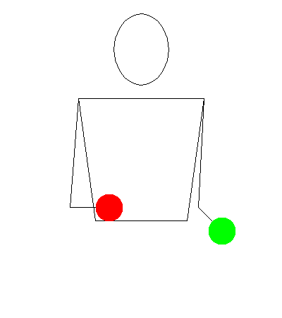

# Basisprincipes van Werpjongleren - Cascade

Een (traditionele) methode om te leren jongleren met 3 objecten. Modernere benaderingen zoals de [5-stappenmethode](5-Step%20Methode.md) van [[Person/Craig Quat]] vullen deze aan en breiden haar uit.

Dit basispatroon, evenals de didactische aanpak om het te leren, is grotendeels onafhankelijk van het gebruikte materiaal. Of het nu met doeken, ballen, kegels of andere attributen is – de volgordes blijven hetzelfde.

Begin met het visualiseren van een raamwerk voor je lichaam.
Dit geeft het werpvlak aan, dat wil zeggen, het vlak waarin de objecten bewegen. Bovendien helpt het ons de punten te visualiseren waarheen we moeten gooien. Op hoofhoogte (iets hoger dan het hoofd), iets rechts en links naast het hoofd, bevinden zich deze twee punten.

Begin met één object, in het ritme: 1 en 2 – één is gooien en vliegen, 2 is vangen. Het object beschrijft een soort liggende acht op het werpvlak terwijl het van de rechter- naar de linkerhand en terug wisselt.

Twee objecten. Begin met telkens één object per hand. Er wordt gegooid op dezelfde trajecten, het ritme is hier belangrijk. Gooien, gooien, vangen, vangen. (1 en 2 en 3 en 4) – De worpen gebeuren na elkaar, met een tijdsverschil.

Twee objecten, verschillende kleuren. Je begint altijd met één kleur – hierdoor worden rechts en links gelijkmatig getraind. (Eerste reeks R, L – de tweede reeks L, R)

Twee objecten, begin met twee objecten in één hand. Afhankelijk van het attribuut zijn er hier verschillende manieren om de objecten vast te houden.
De basisoefening hier is het individueel weggooien van de objecten uit één hand en het vangen van twee objecten in de andere hand. Ook dit gebeurt weer met een tijdsverschil.

Drie objecten. Twee in de ene hand, één in de andere. De hand met 2 objecten begint te gooien. In principe is dit slechts een combinatie van de voorgaande oefeningen met 2 objecten.

Dit basisprincipe wordt ook gebruikt bij de volgende [partneroefening](Partnerübungen%20Wurfjonglage%20Kaskade.md).
