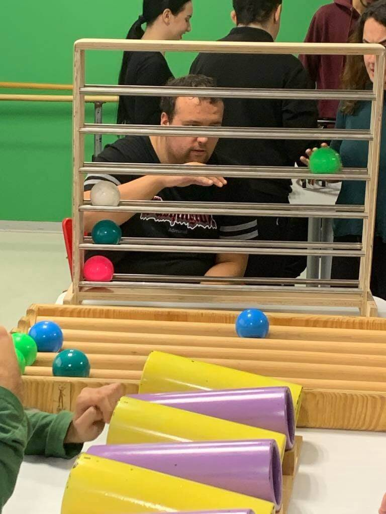

# **Poczucie Bezpieczeństwa: Klucz dla Autyzmu**

[Monokyklo](Monokyklo.md) - Saloniki, Grecja
*Napisane przez Evę Parlani*

## **Początek**

{ width=200 }
Zespół **Monokyklo** wprowadził metody *Funkcjonalnego Żonglowania* w Salonikach, z głównym celem uczynienia **sztuki cyrkowej dostępną dla osób z niepełnosprawnościami**. Zespół składał się z trenerów posiadających doświadczenie w sztukach cyrkowych oraz specjalistyczne szkolenie z Funkcjonalnego Żonglowania, zdobyte poprzez udział w międzynarodowych seminariach i kursach dla facylitatorów.

Projekt zatytułowany **„Tocząca się Piłka”** został zaprojektowany jako **zintegrowana interwencja** w różnych **Dziennych Centrach Pomocy Osobom Niepełnosprawnym (DCPON)** w Salonikach. Jego celem było stworzenie **kreatywnej, integracyjnej przestrzeni do ekspresji** poprzez język żonglowania i ruchu.

Jako facylitatorka z doświadczeniem w warsztatach cyrkowych i po szkoleniach w **Salonikach, Budapeszcie i Mediolanie**, przystąpiłam do projektu z **głębokim pragnieniem udostępnienia sztuk cyrkowych wszystkim** – wolnych od wykluczenia czy dyskryminacji. Jako liderka zespołu skupiłam się na **wzmacnianiu dynamiki grupowej** i tworzeniu **bezpiecznego, wspierającego środowiska**, w którym uczestnicy mogliby z **pewnością siebie i komfortem** eksplorować nieznaną aktywność.

Kluczowym elementem projektu było to, że **odwiedzaliśmy uczestników w ich własnym środowisku**, zabierając ze sobą wszystkie niezbędne materiały. Takie podejście, które pozwalało osobom pozostać w **znajomych i bezpiecznych przestrzeniach**, okazało się kluczowe dla ułatwienia ich **wczesnego zaangażowania i komfortu** w zajęcia. Stało się jasne, że **szacunek dla rytmu i indywidualności każdego uczestnika**, wraz z **aktywną współpracą z pracownikami ośrodków**, znacząco przyczyniły się do sukcesu projektu.

---
## **Przypadek Nikosa**

Wśród wielu historii, które się pojawiły, wyróżnił się **Nikos**. Nikos, mający około dziesięciu lat, jest **w spektrum autyzmu**. Ma **ograniczone zdolności mowy i ekspresji**, a zazwyczaj **porusza się w przestrzeni tylko z pomocą** nauczyciela specjalnego. Był szczególnie wrażliwy na **głośne dźwięki** i **nagłe ruchy**, co sprawiało, że był ostrożny i niepewny podczas naszych początkowych sesji.

Podczas naszych **dwóch pierwszych wizyt** Nikos pozostawał na dystans. **Nie zbliżał się do rekwizytów**, a mimo że zwracaliśmy się do niego z otwartością i troską, **nie reagował na interakcję werbalną**. Jego **fizyczny i emocjonalny dystans** pozostawał niezmienny.

Jednak coś się zmieniło podczas **trzeciej sesji**. Po raz pierwszy **Nikos sam chwycił piłki do żonglowania**, nawiązał **kontakt wzrokowy** i **zaakceptował naszą obecność**. Od tego momentu zaczął się tworzyć kontakt. Zaczął **witać nas z zaufaniem**, pomagać w przygotowaniu przestrzeni, **próbować nowych kombinacji** i **samodzielnie wracać do rekwizytów**.

Wierzę, że udało nam się zaoferować Nikosowi **niezagrażające środowisko** – przestrzeń, w której mógł **eksperymentować, tworzyć, próbować, a nawet ponosić porażki** bez obawy przed oceną. Była to **bezpieczna przestrzeń do samowyrażania się** i odkrywania, gdzie jego proces mógł przebiegać **w jego własnym tempie**.

Od tego momentu Nikos **nigdy nie opuścił żadnej sesji**. **Pamiętał kombinacje**, które ćwiczyliśmy, **z entuzjazmem próbował nowych** i coraz częściej wykazywał **niezależność** w swoich eksploracjach. Z czasem **ograniczył poleganie na swoim nauczycielu wspierającym**, a w potężnym momencie nawiązania kontaktu zaczął **dzielić się z nami osobistymi informacjami** – co było oznaką głębokiego zaufania.

Dzięki temu procesowi zaobserwowaliśmy wyraźny **wzrost pewności siebie Nikosa**, **umiejętności komunikacyjnych** i **otwartości społecznej**. Jego podróż jest tylko jednym z przykładów **transformującej mocy Funkcjonalnego Żonglowania**, zarówno dla **rozwoju psycho-emocjonalnego**, jak i **aktywacji fizycznej**.

{ align=left width=400 }

---

## **Osobista Refleksja**
To doświadczenie było dla mnie **głęboko transformujące** – nie tylko zawodowo, ale i osobiście. Mogłam **zastosować metodę, w którą wierzę**, a jednocześnie zobaczyć, jak **cyrk może służyć jako narzędzie integracji, wzmocnienia i komunikacji**.

Codzienny kontakt z uczestnikami – ich **unikalne reakcje**, ich **małe lub wielkie zwycięstwa** – przypomniał mi o **sile tkwiącej w prostocie**: prostocie **ruchu**, **zabawy**, **bycia obecnym**.

Ten proces **wzmocnił mnie jako trenera**, jako facylitatorkę i jako człowieka. Potwierdził moje przekonanie, że **sztuka może być mostem** – narzędziem **dostępu**, **połączenia** i **solidarności**.
