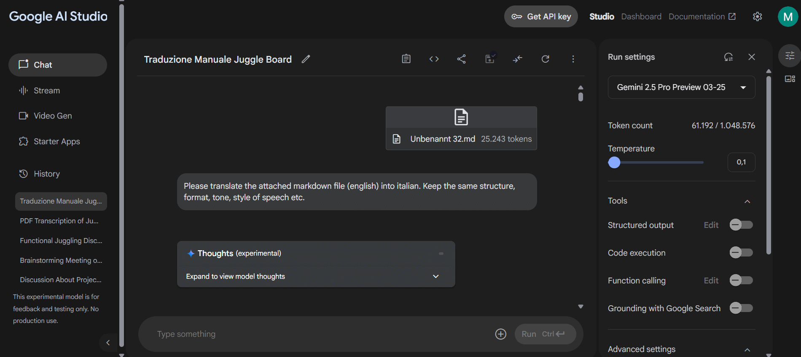

# Tutorial: Traduzir Documentos PDF Usando Modelos de Linguagem Grandes

## Introdução

Este tutorial descreve um processo para traduzir o conteúdo de documentos PDF, particularmente aqueles que contêm texto baseado em imagem não selecionável, usando Modelos de Linguagem Grandes (LLMs). O fluxo de trabalho envolve otimizar o PDF, extrair texto via Reconhecimento Ótico de Caracteres (OCR), traduzir o texto e, finalmente, reformatar a tradução em um PDF.

**Pré-requisitos:**

*   Uma Conta Google (para aceder ao Google AI Studio).
*   Opcional: Software de otimização de PDF (por exemplo, pdf24 Creator).
*   Opcional: Um editor de texto ou processador de texto capaz de lidar com Markdown e exportar para PDF (por exemplo, Obsidian, Microsoft Word).

## Passo 1: Preparar o Documento PDF

**Objetivo:** Reduzir o tamanho do ficheiro PDF para otimizá-lo para processamento pelo LLM, mantendo a legibilidade do texto. Os LLMs geralmente têm limites de tamanho de entrada e ficheiros menores processam de forma mais eficiente.

**Considerações:**

*   **PDFs baseados em texto:** Se o texto dentro do PDF puder ser selecionado (significando que está incorporado eletronicamente), a redução do tamanho do ficheiro é geralmente mais fácil e pode atingir tamanhos menores sem perda de qualidade.
*   **PDFs baseados em imagem:** Se as páginas do PDF forem imagens de texto (o texto não pode ser selecionado individualmente), a redução do tamanho envolve compressão de imagem. Deve-se ter cuidado para não reduzir a qualidade a ponto de o texto se tornar ilegível para OCR.

**Procedimento (Exemplo usando pdf24):**

1.  Abra o seu documento PDF numa ferramenta como o pdf24 Creator ([https://www.pdf24.org/](https://www.pdf24.org/)).
2.  Utilize as funcionalidades de compressão ou redução de tamanho. Configurações comuns e eficazes incluem:
    *   Ativar otimização para web.
    *   Converter cores para tons de cinza.
3.  Experimente os níveis de compressão, visando um tamanho de ficheiro inferior a **5 MB**, garantindo que o texto permaneça claro e legível.
4.  Guarde o ficheiro PDF otimizado.

## Passo 2: Extrair Texto Usando o Google AI Studio (Transcrição/OCR)

**Objetivo:** Utilizar as capacidades multimodais de um LLM para realizar OCR no PDF preparado e extrair o conteúdo textual num formato estruturado.

**Procedimento:**

1.  Navegue até ao **Google AI Studio** ([https://aistudio.google.com/](https://aistudio.google.com/)) e inicie sessão com a sua Conta Google. Nota: O AI Studio é principalmente uma ferramenta para experimentar modelos e prompts.
2.  Inicie uma nova sessão ou chat.
3.  Anexe o ficheiro PDF otimizado à sua sessão (por exemplo, usando o botão de anexo ou arrastar e soltar).
4.  Introduza o seguinte prompt na área de mensagem do utilizador:
    ```
    Por favor, transcreva o PDF anexado. Ele contém imagens com texto, exigindo OCR. Apresente a transcrição em formato Markdown adequado, utilizando cabeçalhos e listas para criar uma estrutura que imite de perto o layout do documento original.
    ```
5.  Configure as definições do modelo:
    *   Mantenha as definições padrão, a menos que tenha requisitos específicos.
    *   Defina a **Temperatura** para **0.1**. Uma temperatura mais baixa incentiva uma saída mais determinística e menos criativa, o que é adequado para uma transcrição precisa.
6.  Submeta o prompt. O processo de transcrição pode levar vários minutos (potencialmente 4-6 minutos ou mais, dependendo do tamanho e complexidade do PDF).
7.  Assim que a geração estiver completa, copie o texto Markdown resultante.
    *   *Método 1:* Use a opção de cópia frequentemente fornecida na interface (por exemplo, através de um menu associado à resposta).
    *   *Método 2:* Selecione manualmente todo o texto gerado e copie-o (Ctrl+C ou clique com o botão direito -> Copiar).
8.  Cole o texto Markdown copiado num editor de texto simples (como Bloco de Notas, VS Code, Obsidian, etc.).
9.  Guarde este conteúdo como um ficheiro de texto simples. Recomenda-se o uso de extensões `.txt` ou `.md` (Markdown). A formatação Markdown ajuda a preservar a estrutura do documento (cabeçalhos, listas).

{ width=600 }

## Passo 3: Traduzir o Texto Extraído Usando o Google AI Studio

**Objetivo:** Traduzir o texto Markdown extraído para o idioma de destino desejado, preservando a estrutura e formatação originais.

**Procedimento:**

1.  No **Google AI Studio**, inicie um **novo chat** para garantir um contexto fresco para a tarefa de tradução.
2.  Anexe o ficheiro `.txt` ou `.md` guardado contendo o texto Markdown extraído.
3.  Introduza um prompt de tradução, especificando os idiomas de origem e destino. Exemplo de Inglês para Italiano:
    ```
    Por favor, traduza o ficheiro Markdown anexado (Inglês) para Italiano. Mantenha a estrutura original, formatação, tom e estilo de fala precisamente.
    ```
    *   **Modifique o prompt** de acordo com os seus idiomas de origem e destino específicos (por exemplo, "...traduza o ficheiro Markdown anexado (Alemão) para Espanhol..."). A qualidade da tradução pode variar dependendo do par de idiomas.
4.  Configure as definições do modelo:
    *   Certifique-se de que as definições padrão são adequadas.
    *   Defina a **Temperatura** para **0.1** para promover a fidelidade ao texto e à estrutura de origem durante a tradução.
5.  Submeta o prompt. A tradução também pode levar vários minutos, comparável ao tempo de transcrição.
6.  Após a geração, copie o texto Markdown traduzido usando os métodos descritos no Passo 2 (botão de cópia da interface ou seleção manual).

{ width=600 }

## Passo 4: Reformatar o Texto Traduzido num Documento PDF

**Objetivo:** Converter o texto Markdown traduzido de volta para um documento PDF para partilha ou arquivamento.

**Procedimento:**

1.  Cole o texto Markdown traduzido copiado numa aplicação adequada.
2.  **Recomendado:** Use um editor de texto ou processador de documentos que compreenda a formatação Markdown para preservar a estrutura (cabeçalhos, listas, etc.).
    *   O **Obsidian** ([https://obsidian.md/](https://obsidian.md/)) é uma ferramenta gratuita que funciona bem com ficheiros Markdown e geralmente tem capacidades de exportação para PDF (diretamente ou através de plugins).
    *   Processadores de texto modernos (como o Microsoft Word) também podem importar ou colar Markdown e permitir guardar/exportar como PDF, embora a fidelidade da formatação possa variar.
    *   Conversores dedicados de Markdown para PDF também estão disponíveis online ou como software instalável.
3.  Use a função "Exportar para PDF" ou "Guardar como PDF" da aplicação.
4.  Reveja o PDF resultante para garantir que a formatação e o conteúdo aparecem como esperado.

## Conclusão

Este tutorial demonstrou um fluxo de trabalho para alavancar o Google AI Studio para transcrever e traduzir documentos PDF, incluindo aqueles que requerem OCR. Ao preparar o PDF, extrair texto usando um LLM configurado, traduzir o resultado e reformata-lo, os utilizadores podem obter versões traduzidas dos seus documentos. Embora este método ofereça uma solução gratuita ou de baixo custo, os utilizadores devem estar cientes de potenciais variações na precisão do OCR e na qualidade da tradução, especialmente para layouts complexos ou idiomas menos comuns. Os tempos de processamento dependem significativamente do tamanho do documento e da carga do servidor.
