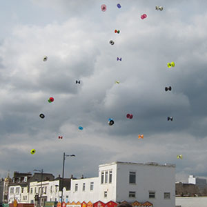

> [!info] Stručný popis
> Súťaž v hádzaní diabola, kde vyhráva najvyšší čistý hod a chyt.

{ width=300 }

**Veľkosť skupiny**: 2 až 40 hráčov
**Obtiažnosť**: stredná
**Materiál**: Jedno diabolo a paličky na hráča, otvorený priestor s dostatočnou výškou
**Trvanie**: približne 5-10 minút

## Popis hry

Všetci hráči súčasne hodia svoje diabolo vysoko a musia ho čisto chytiť, aby zostali v hre. Hráč vypadáva, ak je hod nebezpečný, nedá sa chytiť alebo nie je chytený čisto.

Opakujte kolá, kým nezostane len niekoľko hráčov. Vo finále vyhráva hráč, ktorý predvedie najvyšší bezpečný hod a zároveň ho aj chytí.

## Príprava

- Použite vysokú vnútornú halu alebo vonkajší priestor bez prekážok nad hlavou.
- Vyznačte priestor na hádzanie a držte divákov ďaleko od zóny dopadu.
- Rozhodnite sa, či hráči musia chytiť svoje vlastné diabolo, alebo môžu chytiť akékoľvek diabolo.

## Variácie

- Povoliť chytanie akéhokoľvek diabola pre chaotické skupinové hranie.
- Vyžadovať od každého hráča, aby chytil svoje vlastné diabolo, pre prísnejšiu verziu.
- Namiesto výšky použiť vzdialenosť od seba.
- Povoliť chytanie v pároch pre tímovú verziu.

## Bezpečnostné upozornenia

Vysoko hodené diabolo je tvrdé a nep предvídateľné. Vyčistite priestor dopadu a zastavte hru, ak sa hody blížia k divákom.

## Zdroj

- [JugglingWorld - Juggling Games](https://www.jugglingworld.biz/tricks/juggling-games/), sekcia: Diabolo Games, názov: Highest Throw.
- [UCircus circus games page](https://ucircus.co.uk/resources-circus-games/), karta zdroja: Diabolo Highest Throw.
- UCircus kurzy: Diabolo.
- Referenčný obrázok UCircus: `../img/diabolo-highest-throw.jpg`.
