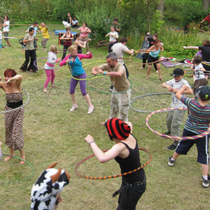

> [!info] Krátky opis
> Hra na vyraďovanie s obručami inšpirovaná formátom gladiátorských hier.

{ width=300 }

**Veľkosť skupiny**: 4 až 40 hráčov
**Obtiažnosť**: stredná
**Materiál**: Jedna obruč na hráča, vyznačený hrací priestor
**Trvanie**: približne 5 – 15 minút

## Opis hry

Hráči udržiavajú obruč v pohybe počas pohybu v aréne. Snažia sa prinútiť ostatných hráčov stratiť kontrolu nad svojou obručou bez nebezpečného kontaktu.

## Príprava

- Každému hráčovi dajte obruč.
- Definujte, čo sa považuje za aktívne udržiavanie obruče: točenie na páse, na rukách alebo držanie obruče v určitej polohe.
- Vyznačte arénu a dohodnite sa na povolených spôsoboch zasahovania.

## Pravidlá

1. Všetci hráči súčasne začnú dohodnutú akciu s obručou.
2. Hráči sa pohybujú po aréne a snažia sa narúšať akciu s obručou ostatných hráčov iba povoleným kontaktom.
3. Hráč vypadáva, keď mu obruč spadne, zastaví sa, opustí hraciu plochu alebo použije nelegálny kontakt.
4. Vypadnutí hráči opustia arénu aj so svojou obručou.
5. Posledný aktívny hráč vyhráva.

## Variácie

- Použite pravidlá bez kontaktu, kde hráči môžu iba blokovať priestor.
- Hrajte tímové kolá s farebnými obručami alebo rozlišovacími znakmi.
- Pre pokročilých hráčov vyžadujte špecifický štýl točenia obruče.

## Bezpečnostné upozornenia

Obruče môžu zasiahnuť tvár a prsty. Kontakt udržiavajte jemný a zakážte mávanie obručami smerom k ľuďom.

## Zdroj

- Karta zdroja UCircus: [Hula Hoop Gladiators](https://ucircus.co.uk/resources-circus-games/)
- Kurzy UCircus: Hoop, Knockout
- Lokálny zdroj obrázka: `../img/hula-hoop-gladiators.jpg`
- Spracovanie zdroja: Presná variácia UCircus potrebuje potvrdenie; tento návrh prispôsobuje všeobecnú štruktúru gladiátorských hier obručiam.
- Dodatočná referencia: [JugglingWorld žonglérske hry](https://www.jugglingworld.biz/tricks/juggling-games/)
- Dodatočná referencia pre gladiátorský/bojový kontext: [Combat (juggling)](https://en.wikipedia.org/wiki/Combat_(juggling))
