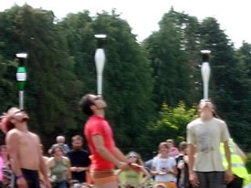

> [!info] Stručný popis
> Hráči balancujú dohodnutý predmet, napríklad kyjak alebo aj jednokolku, na brade alebo inom určenom mieste na balancovanie.

{ width=300 }

**Počet hráčov**: 3 až 60  
**Obtiažnosť**: ťažká  
**Materiál**: Kyjaky, jednokolky alebo iné predmety na balancovanie  
**Trvanie**: približne 5 – 15 minút

## Popis hry

Hráči balancujú dohodnutý predmet, napríklad kyjak alebo aj jednokolku, na brade alebo inom určenom mieste na balancovanie. Vyhráva posledný hráč, ktorému sa podarí udržať rovnováhu.

## Variácie

Ak je základné balancovanie príliš ľahké, pridajte pohyb alebo malú prekážkovú dráhu.

## Bezpečnostné pokyny

Udržujte hraciu plochu voľnú a pred začiatkom kola vymedzte jej hranice. V prípade kontaktných hier sa zamerajte na rekvizity, nie na telá. Pri hrách s hádzaním, jazdou, balancovaním alebo akrobaciou nechajte dostatok priestoru na neúspešné pokusy a kolo ukončite, ak skupina začne podstupovať nebezpečné riziká.

## Zdroj

[JugglingWorld - Juggling Games](https://www.jugglingworld.biz/tricks/juggling-games/), sekcia: Balancing Games.
