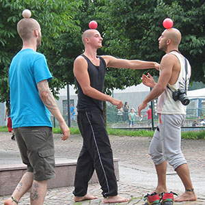

> [!info] Короткий опис
> Гра на вибування з контактними м'ячами, де гравці захищають баланс власної конструкції, одночасно заважаючи іншим.

{ width=300 }

**Кількість гравців**: від 3 до 30  
**Складність**: середня  
**Матеріал**: Контактні м'ячі, зазвичай чотири на гравця для піраміди  
**Тривалість**: приблизно 5-10 хвилин

## Опис гри

Кожен гравець починає з узгодженої форми з контактних м'ячів. У версії JugglingWorld використовується піраміда з чотирьох м'ячів. Гравці рухаються по арені, намагаючись порушити конструкції інших, зберігаючи при цьому власну цілісною.

Гравець вибуває, коли м'яч падає, конструкція руйнується або він використовує заборонений контакт. У версії з пірамідою з чотирьох м'ячів гравці можуть штовхати піраміду іншого гравця лише власною пірамідою. Пальці, вільні руки, поштовхи тілом та кидки заборонені. Перемагає останній гравець, чия конструкція залишається неушкодженою.

## Підготовка

- Домовтеся про необхідну форму, наприклад, один м'яч у балансі або піраміда з чотирьох м'ячів.
- Визначте невелику арену.
- Перед початком раунду визначте дозволені види контакту.

## Варіанти

- Для початківців використовуйте балансування одного м'яча.
- Для досвідчених гравців вимагайте піраміду з чотирьох м'ячів.
- Проводьте тихі раунди у сповільненому режимі, де швидкість заборонена.

## Заходи безпеки

Контактні м'ячі можуть бути важкими. Грайте повільно та забороняйте кидки, удари, поштовхи руками та зіткнення тілами.

## Джерело

- [JugglingWorld - Juggling Games](https://www.jugglingworld.biz/tricks/juggling-games/), розділ: Gladiators, назва: Contact Juggling Gladiators.
- [Сторінка циркових ігор UCircus](https://ucircus.co.uk/resources-circus-games/), картка джерела: Contact Ball Gladiators.
- Заняття UCircus: Контакт, Вибування, Баланс.
- Зображення-посилання UCircus: `../img/contact-ball-gladiators.jpg`.
