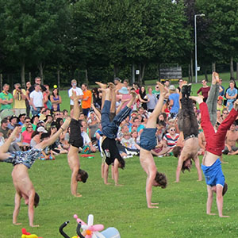

> [!info] Короткий опис
> Змагання на витривалість у стійці на руках, де учасники якомога довше утримують цю позу.

{ width=300 }

**Кількість учасників**: від 2 до 40 гравців  
**Складність**: складно  
**Матеріал**: М'яка підлога, мати або трава  
**Тривалість**: приблизно 3-10 хвилин

## Опис гри

Усі учасники за сигналом починають стійку на руках і намагаються утримати узгоджену форму стійки довше за всіх. Гравець вибуває, коли його ноги торкаються землі, він залишає узгоджену зону або порушує узгоджене правило опори.

Перемагає останній учасник, який залишається у правильній стійці на руках.

## Підготовка

- Оберіть дозволену форму: вільна стійка на руках, стійка біля стіни, стійка з підтримкою партнера або стійка на руках з пересуванням.
- Використовуйте безпечну поверхню та залиште достатньо місця між учасниками.
- Вирішіть, чи дозволені невеликі корекції пересуванням рук.

## Варіанти

- Проводьте окремі раунди для новачків та досвідчених.
- Використовуйте стійку на руках з підтримкою партнера для інклюзивних груп.
- Встановіть максимальний час і оголосіть усіх гравців, що залишилися, спільними переможцями.

## Заходи безпеки

Спочатку розімніть зап'ястя та плечі. Не використовуйте тиск вибування щодо учасників, які не можуть безпечно вийти зі стійки на руках.

## Джерело

- [JugglingWorld - Juggling Games](https://www.jugglingworld.biz/tricks/juggling-games/), розділ: Endurance Games/World Records.
- [Сторінка циркових ігор UCircus](https://ucircus.co.uk/resources-circus-games/), картка джерела: Handstand Endurance.
- Заняття UCircus: Стійка на руках, Нокаут, Баланс.
- Референтне зображення UCircus: `../img/handstand-endurance.jpg`.
