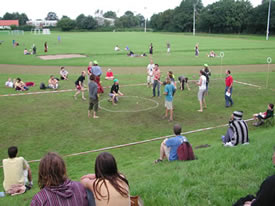

> [!info] Короткий опис
> Велика командна гра, що перетворює ролі з квідичу на гру з жонглюванням та метанням у ціль.

{ width=300 }

**Кількість гравців**: від 10 до 40 осіб  
**Складність**: середня  
**Матеріали**: м'ячі для жонглювання або м'які м'ячі, обручі або кільця для цілі, маркери команд, за бажанням — шарфи  
**Тривалість**: приблизно 15-30 хвилин

## Опис гри

«Жонглюючий квідич» — це велика командна гра, натхненна квідичем, але адаптована для циркових конвенцій. Дві команди намагаються здобути очки, переміщуючи м'яч по ігровому полю та закидаючи його в кільце-ціль. Водночас спеціальні ролі створюють додатковий рух, перешкоди та тактичні можливості.

Проста версія гри передбачає такі ролі:

- **Мисливці (Chasers)** переміщують основний м'яч і намагаються закинути його в ціль суперника.
- **Захисники (Keepers)** обороняють зону цілі.
- **Відбивачі (Beaters)** використовують м'які м'ячі, щоб тимчасово зупинити гравців команди суперника.
- **Ловці (Seekers)** намагаються виконати окреме додаткове завдання, наприклад, спіймати шарф, знайти прихований предмет або виконати жонглерське завдання.

Гравці можуть переміщуватися з основним м'ячем лише під час виконання узгодженого циркового завдання, наприклад, жонглюючи трьома м'ячами, передаючи їх під час руху або підтримуючи один м'яч у простому ритмі підкидань. Якщо гравець впускає м'яч, він повинен зупинитися, відновити завдання і лише потім продовжити.

Основна гра триває визначений час. Перемагає команда, яка набрала найбільше очок. Якщо використовується завдання для ловця, його виконання приносить бонусні очки або негайно завершує раунд, залежно від обраних правил.

## Основні правила

1. Позначте прямокутне поле з кільцем-ціллю або зоною для нарахування очок на кожному кінці.
2. Розділіть групу на дві команди та розподіліть ролі.
3. Мисливці забивають очки, закидаючи основний м'яч у ціль суперника.
4. Гравці, які несуть або контролюють основний м'яч, повинні підтримувати активність узгодженого жонглерського завдання.
5. Відбивачі можуть торкатися або влучати в суперників лише м'якими м'ячами та лише нижче рівня плечей.
6. Гравець, якого торкнулися, коротко зупиняється, повертається до точки відновлення або виконує невелике штрафне завдання, перш ніж повернутися до гри.
7. Завдання ловця виконується паралельно з основною грою і має бути достатньо помітним, щоб обидві команди розуміли, коли воно завершене.
8. Перемагає команда з найвищим рахунком наприкінці гри.

## Варіанти

- Для початківців: приберіть ролі відбивачів і ловців, грайте лише мисливцями та захисниками, зосередившись на закиданні м'яча в ціль.
- Для версії з акцентом на жонглювання: вимагайте від кожного мисливця підтримувати каскад з трьох м'ячів або простий ритм підкидань одного м'яча під час руху.
- Для безпечнішої версії для дітей: використовуйте лише м'які м'ячі, дозвольте лише ходити та забороніть будь-який фізичний контакт.
- Для конвенційної версії: зробіть завдання ловця абсурдним: спіймати шарф, знайти крихітний золотий реквізит, виконати послідовність трюків або виграти коротку побічну дуель.

## Заходи безпеки

Ця гра може стати хаотичною, оскільки поєднує біг, кидки, різні ролі та реквізит. Використовуйте лише м'які м'ячі, забороніть підкати та блокування корпусом, а також визначте чіткі правила відновлення після падінь м'яча та торкань. Зробіть ігрове поле достатньо великим, щоб гравці могли бачити, куди рухаються, під час роботи з реквізитом.

## Джерело

[JugglingWorld - Juggling Games](https://www.jugglingworld.biz/tricks/juggling-games/), розділ: Miscellaneous!.

Примітка JugglingWorld посилається на стару сторінку правил квідичу `zirkusspiele.de`, але ця сторінка наразі недоступна. Тому цей проєкт документує грабельну гру в стилі квідичу з жонглюванням, а не підтверджену реконструкцію оригінального набору правил за посиланням.
